# ProBreathe - Projektseite
**Ein Projekt von Nele und Tim Ratzka**

➜ <a href="https://github.com/NTCR7/ProBreathe/blob/main/Stundenprotokoll.md">**Entwicklungsprozess** (Stundenprotokolle)</a>

➜ <a href="test">**YouTube-Video**</a> 

## Inhaltsverzeichnis
<!--ts-->
* <a href="https://github.com/NTCR7/ProBreathe/blob/main/README.md#1-einleitung">**1. Einleitung**</a> 
  * <a href="https://github.com/NTCR7/ProBreathe/blob/main/README.md#das-ist-probreathe">**Das ist ProBreathe**</a> 
  * <a href="https://github.com/NTCR7/ProBreathe/blob/main/README.md#der-beweggrund">**Der Beweggrund**</a> 
* <a href="https://github.com/NTCR7/ProBreathe/blob/main/README.md#2-verwendete-programme">**2. Verwendete Programme**</a> 
  * <a href="https://github.com/NTCR7/ProBreathe/blob/main/README.md#kaggle">**kaggle**</a> 
  * <a href="https://github.com/NTCR7/ProBreathe/blob/main/README.md#github">**GitHub**</a> 
* <a href="https://github.com/NTCR7/ProBreathe/blob/main/README.md#2-einf%C3%BChrung--grundeinstellungen-in-kaggle">**2. Einführung & Grundeinstellungen in kaggle**</a> 
* <a href="https://github.com/NTCR7/ProBreathe/blob/main/README.md#3-verwendete-libraries">**3. Verwendete libraries**</a> 
  * <a href="https://github.com/NTCR7/ProBreathe/blob/main/README.md#keras-">**Keras**</a> 
  * <a href="https://github.com/NTCR7/ProBreathe/blob/main/README.md#python-os-library-">**Python os-library**</a> 
  * <a href="https://github.com/NTCR7/ProBreathe/blob/main/README.md#opencv-">**OpenCV**</a> 
  * <a href="https://github.com/NTCR7/ProBreathe/blob/main/README.md#metaplotlib-">**Metaplotlib**</a> 
  * <a href="https://github.com/NTCR7/ProBreathe/blob/main/README.md#seaborn-">**Seaborn**</a> 
  * <a href="https://github.com/NTCR7/ProBreathe/blob/main/README.md#numpy-">**NumPy**</a>
  * <a href="https://github.com/NTCR7/ProBreathe/blob/main/README.md#scikit-learn-">**scikit-learn**</a>
  * <a href="https://github.com/NTCR7/ProBreathe/blob/main/README.md#tqdm-">**tqdm**</a>
  * <a href="https://github.com/NTCR7/ProBreathe/blob/main/README.md#gradio-">**Gradio**</a> 
* <a href="https://github.com/NTCR7/ProBreathe/blob/main/README.md#4-funktionsweise-des-models--cnn">**4. Funktionsweise des models & CNN**</a>
  * <a href="https://github.com/NTCR7/ProBreathe/blob/main/README.md#datenvorbereitung">**Datenvorbereitung**</a>
     * <a href="https://github.com/NTCR7/ProBreathe/blob/main/README.md#aufteilung-in-train--test---val-daten">**Aufteilung in Train-, Test- & Val-Daten**</a>
     * <a href="https://github.com/NTCR7/ProBreathe/blob/main/README.md#normalisierung-der-daten">**Normalisierung der Daten**</a>
     * <a href="https://github.com/NTCR7/ProBreathe/blob/main/README.md#data-augmentation">**Data Augmentation**</a>
  * <a href="https://github.com/NTCR7/ProBreathe/blob/main/README.md#modellarchitektur">**Modellarchitektur**</a>
     * <a href="https://github.com/NTCR7/ProBreathe/blob/main/README.md#verhalten-des-modells-im-training">**Verhalten des Modells im Training**</a>
  * <a href="https://github.com/NTCR7/ProBreathe/blob/main/README.md#training-des-modells">**Training des Modells**</a>
  * <a href="https://github.com/NTCR7/ProBreathe/blob/main/README.md#leistung--genauigkeit">**Leistung & Genauigkeit**</a>
  * <a href="https://github.com/NTCR7/ProBreathe/blob/main/README.md#anwendung">**Anwendung**</a>
     * <a href="https://github.com/NTCR7/ProBreathe/blob/main/README.md#klassifizierung-neuer-bilder">**Klassifizierung neuer Bilder**</a>
     * <a href="https://github.com/NTCR7/ProBreathe/blob/main/README.md#gradio-schnittstelle">**Gradio-Schnittstelle**</a>
* <a href="https://github.com/NTCR7/ProBreathe/blob/main/README.md#5--projektzusatz--einfluss-verschiedener-parameter">**5. -Projektzusatz- Einfluss verschiedener Parameter**</a>
  * <a href="https://github.com/NTCR7/ProBreathe/blob/main/README.md#hyperparameteroptimierung-durch-gridsearchcv">**Hyperparameteroptimierung durch GridSearchCV**</a>
  * <a href="https://github.com/NTCR7/ProBreathe/blob/main/README.md#empirischer-versuch-%C3%A4nderung-data-augmentation">**Empirischer Versuch Änderung Data-Augmentation**</a>
* <a href="https://github.com/NTCR7/ProBreathe/blob/main/README.md#6-das-ergebnis--anwendung">**6. Das Ergebnis & Anwendung**</a>
* <a href="https://github.com/NTCR7/ProBreathe/blob/main/README.md#7-reflexion">**7. Reflexion**</a> 
* <a href="https://github.com/NTCR7/ProBreathe/blob/main/README.md#8-quellenverzeichnis">**8. Quellenverzeichnis**</a> 
<!--te-->
## 1. Einleitung

### Das ist ProBreathe
ProBreathe ist ein KI-Tool, welches eine schnelle Erkennung von Lungenentzündungen anhand von Röntgenbildern der Lunge ermöglicht. Die Basis dafür stellt ein Convolutional Neural Network (CNN) dar, trainiert durch machine learning. 

### Der Beweggrund
In unserer modernisierten Welt kommt es immer wieder zu riesigen Fortschritten im Bereich der Technologie. Der Grundstein der Technik war die Basisinnovation des Computers im Jahre 1941. Auf dieser Grundlage scheint nun die nächste Basisinnovation entstanden zu sein - eine künstliche Intelligenz (KI) wie ChatGPT. Diese Form von KI kann von der Erstellung von Referaten und Textzusammenfassung bis zum Bestehen des Abiturs alles, was mit Text zusammenhängt. Diese Technologie ermöglicht es jedem User ohne Vorkenntnisse die Vorteile einer solchen KI zu nutzen. Dadurch haben bereits rieisige Tech-Konzerne wie Microsoft ChatGPT in ihre Suchmaschiene Bing implementiert. Google bangt um sein Hauptgeschäft - die Internetsuche, welche bald durch KI-Assistenten abgelöst werden könnte. Ein Bestandteil davon sind auch neuronale Netzwerke, welche es der KI ermöglichen zu lernen und somit selbst eigene Schlüsse und Kausalitäten hervorzubringen. Eine Kategorie der neuronalen Netzwerke stellt das Convolutional Neural Network (CNN) dar, welches sich besonders für die Bilderkennung eignet. Sie werden heutzutage schon oft in Autos zur Erfassung von Verkehrszeichen benutzt (zum Beispiel bei Tesla, Audi oder BMW). Ein CNN kann aber auch in anderen Bereichen von großem Vorteil sein.
 
Aufgrund eins hohen Interesse im Bereich der Medizin entschieden wir uns ein CNN zu erstellen, welches repetitive medizinische Aufgaben bei der Bildanalyse zur Mustererkennung übernimmt. Denn ein CNN kann weitaus einfacher bestimmte Muster wiedererkennen als ein Mensch und ist dabei weniger fehleranfällig. Wir entschlossen uns somit ein CNN zur Erkennung von Lungenentzündungen zu programmieren. Dabei wollen wir das Netzwerk auf die höchstmögliche Genauigkeit trainieren und wichtigste Einflussfaktoren auf die Genauigkeit identifizieren und analysieren. 

Die spezifische Anwendung wurde gewählt, da es in unser modernisierten globalen Welt aufgrund der Verbrennung von fossilen Brennstoffen immer öfter zu starker Luftverschmutzung kommt. Eine Folge von dieser verschmutzten Luft ist die Gesundheitsschädigung in Form einer Lungenentzündung, welche beispielsweise auch bei Covid-19 auftreten kann. Diese kann teils schwer erkennbar sein und muss ausführlich untersucht werden. Durch ein CNN mit hoher Genauigkeit könnte man den Ärzten diesen Arbeitsschritt abnehmen und so das Gesundheitssystem unterstützen. Denn dieses ist ein essenzieller Teil unserer Infrastruktur und entscheidend für eine nachhaltige soziale Entwicklung.

## 2. Verwendete Programme

### kaggle 
 Das Fundament unseres Projektes stellt die "Data-Science-Plattform" kaggle dar. Die Plattform gehört seit 2010 Google und richtet reglemäßig Wettbewerbe mit bis zu 1.000.000$ Preisgeld aus. Dabei geht es meist darum ein Problem mithilfe von Machine Learning zu lösen, zum Beispiel <a href="https://www.kaggle.com/competitions/asl-fingerspelling">"Google - American Sign Language Fingerspelling Recognition"</a>. kaggle stellt somit ein dafür ausgelgtes Overlay und einen einfachen Zugriff auf riesige Arten verschiednester Datensätze, welche durch User veröffentlicht werden können und ermöglicht eine einfach Integration dieser. Die Plattform exisitiert nur online unter <a href="https://www.kaggle.com/">kaggel.com</a> und ist nicht als Software verfügbar. Die Datensätze müssen also nicht heruntergeladen werden, was die Arbeit an einem Projekt mit verschiedenen Geräten ermöglicht. Dies  ist somit perfekt für eine Gruppenarbeit und das Arbeiten an wechselnden Arbeitsplätzen.
Die offiziellen programmiersprachen von kaggle sind <a href="https://www.python.org/">Python</a> und <a href="https://www.r-project.org/">R</a>. Es ist den usern aber möglich felxibel jegliche andere Programmiersprache durch die Erstellung von Compilern aus dem Quellcode und deren Verwendung im Kernel zu nutzen. Dies ist für diese Projektarbeit aber irrelevant, da für diese Projekt <a href="https://www.python.org/">Python</a> verwendet wird.
Bei kaggle arbeitet man mit Python Notebooks oder auch einfach nur Notebooks. Diese bestehen aus mehreren einzellnen Zellen entweder in Markdown (ähnlich wie hier auf GitHub) oder in der Programmiersprache Python bzw. R. 

Die Programmiersprache Python ist aufgrund ihrer klar definierten Syntax (Schreibweise) und einfachen Lesbarkeit relativ leicht zu erlernen. Die Strukturierung des Codes durch Einrückungen trägt ebenfalls zur Übersichtlichkeit bei. Ein weiterer Vorteil ist, dass Python-Code vor der Ausführung nicht in Maschinencode übersetzt werden muss, was die Portierbarkeit zwischen verschiedenen Betriebssystemen wie Windows oder Linux erleichtert. Ein in Python entwickeltes Programm steht somit direkt einer breiten Plattform zur Verfügung und muss nicht erst speziell an das jeweilige Betriebssystem angepasst werden. Python bietet dem Entwickler auch die Möglichkeit, zwischen mehreren unterstützten Programmierparadigmen zu wählen: der funktionalen, der objektorientierten oder der aspektorientierten Programmierung. Wir verwenden sowohl die funktionale als auch die objektorientierte Programmierung. Bei der funktionalen Programmierung verändert eine Funktion keine Daten, sondern erzeugt nur neue Variablen. Auch unsere Funktionen sind unveränderlich und liefern jedes Mal das gleiche Ergebnis. Die objektorientierte Programmierung kommt zum Einsatz, wenn wir zum Beispiel das Modell erstellen. Dabei wird das Modell als Objekt behandelt, auf das bestimmte Methoden wie `model.add` oder `model.fit` angewendet werden.
Python beinhaltet noch viele weitere Vorteile und Funktionen, die aber für unser Projekt nicht benötigt werden. Schlussendlich war für uns aber auch entschiedend,dass Python eine der am weitesten verbreiteten Programmiersprachen ist. Daund findet online viele Informationen und Möglichkeiten zum selbstständigen Erlernen.

### GitHub 
 <a href="https://github.com/">Github</a> dient zur Softwareverwaltung und lässt sich gleichzetig als soziales Netzwerk für Entwickler charakterisieren. Durch die Erstellung von sogennaten "Repositories" kann man Projekte mit anderen Teilen. Dabei basiert GitHub auf Markdown, man kann jedoch z. B. auch HTML benutzen. GitHub ermöglicht die zeitgleiche Zusammenarbeit an Projekten und das Festhalten der Ergebnisse. Für unser Projekt erfolgte die Dokumentation in Form von Stundenprotokollen und die Plattform wurde für die Projektdarstellung verwendet. 

## 2. Einführung & Grundeinstellungen in kaggle

Die Grundlegenden Schritt zum Erstellen eines Machine-Learning-Projekts mithilfe von kaggle
1. <a href="https://www.kaggle.com/account/login?phase=startRegisterTab&returnUrl=%2F">Erstellung Kaggle-Account</a>
2. `+ Create` → neues Notebook erstellen
3. Erklärung des Notebooks

   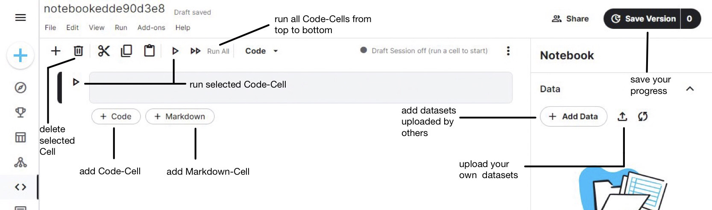

4. Nutzung von Datasets ermöglichen → Internet aktivieren 

   
   
5. Trainingsprozess des CNN mithilfe von lokalem Prozessor beschleunigen

   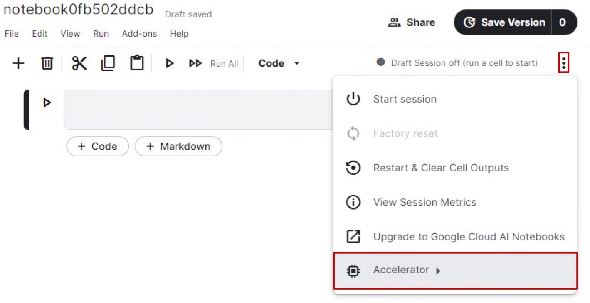

7. Fortschritt abspeichern

   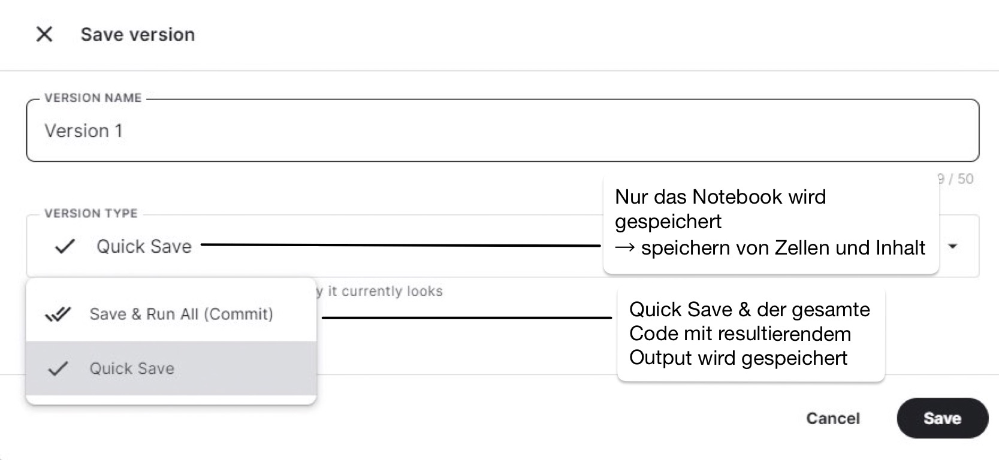

8. Weitere Anpassunsgmöglichkeiten sind für das Speichern möglich, beispielsweiese bei einem "Quick Save" auch den Output zu speichern.

   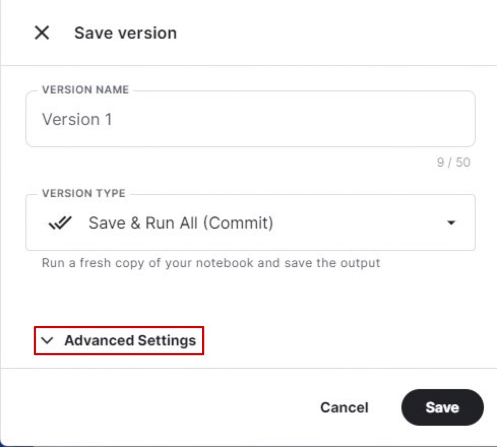

## 3. Verwendete libraries

### Keras  
Keras ist eine Python-Open-Source-Bibliothek, die auf TensorFlow aufbaut. TensorFlow ist eine Programmbibliothek, welche sich den Aufgaben im bereich des machine learning und der künstliche Intelligenz widmet. Diese Programmbibliothek ermöglicht es erst das neuronale Netzwerk zu erstellen und ist mittlerweile zu einem der wichtigsten Frameworks geworden. Das bedeutet, dass TensorFlow die Grundstruktur für die meisten deep-learning-Projekte vorgibt.  
Keras nutzt die durch TensorFlow gegebene Grundstruktur und verbessert sie für eine einfachere und schneller Anwendung. Es handelt sich bei Keras folglich eher um ein „Interface“ (API) als ein „Framwork“. Aber dies ist äußerst ausgereift, weshalb selbst auf der <a href="https://www.tensorflow.org/">TensorFlow</a> Webseite  empfohlen wird es für fast jede Anwendung zu nutzen statt TensorFlow direkt. 
Keras ist außerdem sehr leistungsstark und brüstet sich mit Unternehmen, wie YouTube, der Nasa oder Waymo, welche Keras verwenden. Die Keras-library ist der essenziellste Bestandteil des Projekts, da es für die verschiedenen Schichten unserer CNN und dessen Lernrate verantwortlich ist. Auch `model.fit` stammt aus Keras, welches die entscheidende Funktion ist, welche das Training des Modells durchführt. Die Funktion nimmt also die trainings- und Validierungsdaten, die Anzahl der zu durchlaufenden Epochen und andere Parameter wie die Batchgröße, um dann das Training des Modells durchzuführen. Außerdem ermöglicht die library das temporäre Speichern unseres Modells. Außerdem ist Keras für die Erstellung des Modells an sich verantwortlich. (mehr dazu: <a href="https://github.com/NTCR7/ProBreathe/blob/main/README.md#4-funktionsweise-des-models--cnn"> Funktionsweise des models & CNN</a>)

### Python os-library  
Die Python-library os (Operating System) ermöglicht es uns auf das Dateisystem zuzugreifen udn enthältet daher Funktionen für das Navigieren durch Verzeichnisse, das Erstellen von Dateipfaden und das Abrufen von Dateiinformationen. Wir erstellen mithilfe von ihr Dateipfade zu den benötigten Bildern aus dem Datensatz und den Unterverzeichnissen "PNEUMONIA" oder "NORMAL". os ermöglicht es auch, dass die Pfade korrekt sind, unabhängig von der Schreibweise des jeweiligen Betriebssystems (zum Beispiel Windows oder Linus). 

### OpenCV  
OpenCV (Open Source Computer Vision Library) wurde im Jahre 2002 als Initiative der Intel-Forschung gegründet, um CPU-intensive Anwendungen voranzutreiben. Heutzutage ist die library de-facto ein Standard, wenn es um den Bereich der Verarbeitung von Bildern in Echtzeit geht. Die library ist speziallisiert auf machine learning als auch <a href="https://www.ibm.com/topics/computer-vision">computer vision</a> (Inhalte von Bildern durch Datenextraktion verstehen und erkennen) und stellt für diese Bereiche viele Funktionen als auch über 2.500 Allgorithmen bereit. Außerdem kann OpenCV in C++, Python oder Java verwendet werden. Bei unsererm Modell übernimmt es Aufgaben, wie die Bilder aus den Datein zu laden, sie zu skalieren und in Graustufen zu konvertieren.
Die library wird bereits in vielen Bereichen kommerziell von Unternehmen oder sogar Regierungen verwendet, aber natürlich auch zu Forschungszwecken. 

### Metaplotlib  
Bei Metaplotlib handelt es sich ebenfalls um ein umfassende Python-Open-Source-Library, welche auf die statische, animiete oder sogar interaktive Datenvisualisierung spezialisiert ist. Auf der eigenen Website <a href="https://matplotlib.org">matplotlib.org</a> werden die verschiedenste <a href="https://matplotlib.org/stable/gallery/index.html#">Beispiele</a> vorgestellt. Metaplotlib kann folglich genutzt werden um mithilfe von wenigen Zeilen Code Liniendiagramme, Histogramme, Balkendiagramme, Streudiagramme oder Statistiken mit Personalisierungen wie Titel, Beschriftung der Achsen oder Farben darzustellen.

### Seaborn 
Die Seaborn-library, welche wir ebenfalls benutzen, baut auf Metaplotlib auf und vereinfacht den Code zur Darstellung von biepsielsweise einer Heatmap. Dies ist eine grafische Darstellung von Daten, bei der Farben verwendet werden, um die verschiedene Werte wiederzugeben. Auch Seaborn stellt auf ihrer Webseite viele verschiedene <a href="https://seaborn.pydata.org/examples/index.html">Beispiele</a> zur Verfügung und ergänzt Metaplotlib somit weiter.

### NumPy <a href="https://numpy.org/">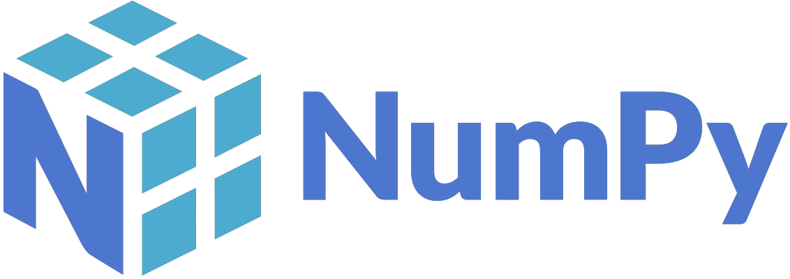</a> 
Diese Python-Open-Source-Library wird als Grundlage für wissenschaftliche Berechnungen bezeichnet. NumPy (Numerical Python) stellt leistungsstarke Funktionen bereit, um große Mengen numerischer Daten und insbesondere Arrays effizient in Python zu verarbeiten. Da bei unserem CNN viel mit Arrays gearbeitet wird, ist die library essenziell auch für die Berechnung der Genauigkeit unserer CNN. Ein Array ist eine Datenstruktur, die zur Speicherung und zum Zugriff auf eine Vielzahl von Werten desselben Typs verwendet wird. Ein Array kann man sich wie ein Regal mit unterschiedlichen Regalfächern vorstellen. Jedes Fach enthält einen bestimmten Wert, und die Fächer sind in einer Reihe hintereinander angeordnet. Jeder Wert im Array hat eine eindeutige Position, den Index.
Arrays sind nützlich, um Daten zu organisieren und auf sie zuzugreifen. Dies gilt insbesondere, wenn wir mit einer großen Anzahl von Werten arbeiten. Mit Hilfe von Arrays können wir die Werte effizient speichern und auf sie zugreifen. Der Index kann für den schnellen Zugriff auf das gewünschte Element verwendet werden, ohne dass wir die gesamte Liste durchsuchen müssen.

### scikit-learn  
sickit-learn (meist: sklearn) ist ebenfalls eine Python-Open-Source-Library und beinhaltet wichtige Funktionen für das machine learning. Sie baut auf den bereits bekannten Bibliotheken Metaplotlib und NumPy auf, macht sich aber zusätzlich  <a href="https://scipy.org/">SciPy</a> zu Nutze (gleiche Betreiber wie bei NumPy, aber mit Fokus auf Algorithmen für wissenschaftliches Rechnen in Python). Manche Bezeichnen sickit-learn bereits als den "Goldstandard" für machine learning. Für unser Modell übernimmt sickit-learn nur die Erstellung einer Confusion Matrix. Die Confusion Matrix wird genutzt, um die Qualität des Erlernten grafisch darzustellen und somit zu bewerten.

### tqdm  
Die Open-Source-Python-Bibliothek tqdm zur Erstellung von Fortschrittsbalken ist besonders hilfreich bei lang andauernden Prozessen mit großen Datensätzen, wie beim Testen verschiedener Paramter für ein CNN. Dabei kann sie Aussagen sowohl über den Fortschritt als auch die verbleibende benötigte Zeit des Prozesse treffen. Die library funktioniert außerdem hervorragend mit Jupyter notebooks wie bei kaggle.

### Gradio 
Gradio ist eine Open-Source-Python-Bibliothek, welche ein schnelles Erstellen einer Benutzoberfläche für Machine-Learning-Modelle ermöglicht. Über die Benutzeroberfläche als Schnittstelle können Benutzer die Funktionalität des Modells interaktiv ausprobieren, beispielsweise durch das Einfügen eigener Bilder. Es eignet sich somit perfekt, um die Funktionalität unseres CNN zu demonstrieren. 
Gradio stellt auf der eignen <a href="https://gradio.app/">Webseite</a> übrigens viele verschieden Interfaces vor. Neben dem von uns verwendeten Interface zur Bildverarbeitung gibt es noch Interfaces, welche sich mit den In- und Outputs von Text, Audio, Skizzen oder tabellarische Daten und Diagramme beschäftigen. Neben dem Gradio-Interface, welches im ursprünglichen genutzten Code-Programme angezeigt wird, erstellt Gradio ebenfalls einen öffentlichen Link, welcher nach 72 Stunden verfällt. Gradio ermöglicht somit ein flexibeles Teilen online, was bei uns leider nicht möglich ist, da das Interface nicht als permanenter Output auf kaggle gespeichert werden kann bzw. der Link zum Browser-Interface ohne das laufende Notebook sofort verfällt.

## 4. Funktionsweise des models & CNN
### Datenvorbereitung
Nachdem nun die nötigen Bibliotheken und Pythonpakete über `!pip install ` und  `import` eingebunden wurden, wird sich der Datenvorbereitung gewidmet. Hauptziele sind hier das Laden und Einbinden des Datensatzes, sowie die  Skalierung und Vorverarbeitung der einzelnen Elemente.
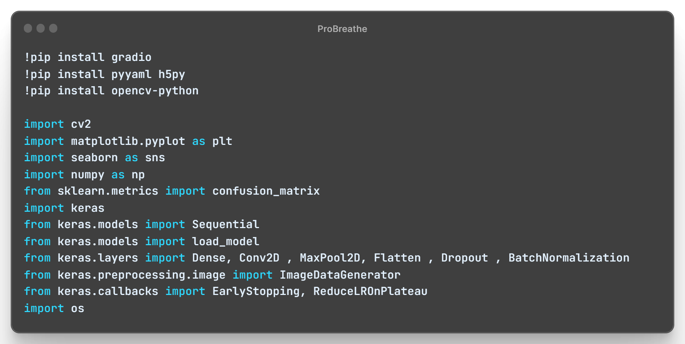
Zuerst wird die Liste die Labels erstellt, welche die Klassen für die spätere Klassifikation der Röntgenbilder darstellen. Die Labels 'PNEUMONIA' und 'NORMAL' spiegeln in diesem Fall die zwei möglichen Klassen wieder, da bei dem Röntgenbild einer Lunge entweder eine Lungenentzündung vorliegt oder ein gesundes Organ. Darüber hinaus wird eine einheitliche Bildgröße für den gesamten Datensatz gewählt, um eine konsistente Datenverarbeitung sicherzustellen. Dies erleichtert dementsprechend die Verarbeitung der Bilder im Allgemeinen und ermöglicht es dem Modell Muster und Merkmale oder Anomalien konsistent zu erkennen. In diesem Fall werden die Bilder einheitlich auf eine Pixelgröße von 150 x 150 Pixel skaliert, was durch die Zeile `img_size= 150` erfolgt. Indem die Bildgröße reduziert wird kann außerdem die Modellgröße optimiert werden und gleichzeitig die Anzahl der Paramter gesenkt werden, was die Komplexität des Modells senkt. Somit kann overfitting verhindert werden, was den Fall darstellt, wenn ein Modell zu stark an die Trainingdaten angepasst ist und dementsprechend selbst zufällige Variationen als wichtiges Merkmal interpretiert. Dies senkt die Genauigkeit des Modells, sodass die Reduzierung der Bildgröße also einen wichtigen Enflussfaktor darstellt.

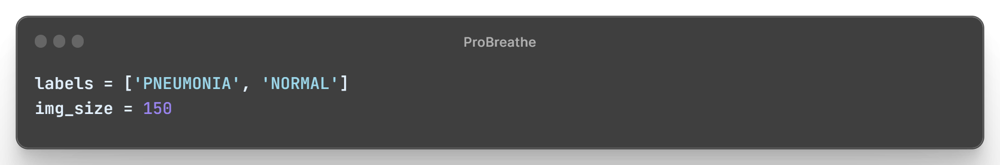

Nachdem diese Grundvorkehrungen getroffen sind, stellt nun die Funktion  `get_data` die Säule für die Einbindung des Datensatzes dar. Vorerst wird die Funktion definiert, sodass sie anschließend ausgeführt werden kann. Dabei nimmt sie den Pfad zu den Rohdaten als Eingabe, was hier durch `def get_data(data_raw):` umgesetzt wird. Um die vorverarbeiteten Daten nun speichern zu können, wird vorerst die leere Liste `data = []` erstellt. 
Bevor die Elemente der Liste zugewiesen werden, muss ein Ordnerpfad für jede Klasse aufgezogen werden. Hierzu wird die Schleife for `class_num, label in enumerate(labels):` angewandt. Durch `enumerate` wird gleichzeitig der Index und den Wert jedes Elementes bestimmt. Dabei bezieht sich der Index auf die Position eines Elements in der Liste, also kann der Index 0,1,2 usw. sein. Ebenfalls wird der Wert beziehungsweise das Label 'PNEUMONIC' oder 'NORMAL' jedem Element zugewiesen. Der Zugriff auf das Index-Labelpaar für jedes Element ist essentiell hinsichtlich dem Datenzugriff, Labelzuordnung und Auswertung des CNN. Somit müssen beispielsweise beim Training eines CNN-Modells die Trainingsdaten in bestimmten Batches oder Chargen aufgegriffen werden. Der Index der Elemente in den Trainingsdaten wird verwendet, um die Batches zu erstellen und die entsprechenden Bilder und Labels für das Training bereitzustellen. Die Zuordnung in Labels stellt bei der Lungenentzündungsvorhersage das Fundament dar, um das Modell anhand der vorhandenen Daten zu trainieren und Merkmale den Labels zuzuordenen.

Um den praktischen Zugriff auf die sortierten Daten zu ermöglichen, werden Pfade zu den Ordnern mit den Labels erstellt. Dabei besteht dieser aus dem Pfad zu den Rohdaten, welcher um den Unterpfad der Labels ergänzt wird. Bei Kaggle konkret stellt unser Basispfad, um an die Daten zu gelangen, den Pfad zum input also `/kaggle/input..` dar. Anschließend werden alle Einträge im Verzeichnis, also die Daten und Unterverzeichnisse abgerufen und in den Variablen entries gespeichert. Nach der Überprüfung, ob es sich tatsächlich um eine Datei handelt, wird die Bilddatei mit OpenCV `cv2` in Graustufen eingelesen. Andernfalls wird ein Fehlercode ausgegeben. Graustufen eignen sich hier, da die Merkmale, welche letztendlich auf eine Lungeentzündung hinweisen, anhand ihrer Helligkeit im Rötgenbild zu erkennen sind. So sind die typischen Ödeme, also das angeschwollene Lungengewebe als helle Flecken oder Ausbildungen zu erkennen. Die entscheidenden Helligkeitsinformationen auf den bereits schwarz weißen Rötngenbilder können schließlich durch das Einlsesen im Graustufenformat beibehalten werden. Außerdem wird nun auf unsere festgelegte Bildgröße von 150 x 150 Pixeln zurückgegriffen, sodass mithilfe `cv2.resize(img_arr, (img_size, img_size))` alle Bilder einhetlich Skaliert werden. Zuletzt werden die Elemente im Numpy-Array, also einer Datenstruktur, welche Elemente des gleichen Typs speichern kann, eingespeist. Zudem werden die Elemente als einzelne Objekte gespeichert. Unsere erstellte Liste für `data` wurde also nun in ein Array umgewandelt, um die effizientere Arbeit mit den Daten zu ermöglichen.
An diesem Punkt ist nun die Definition der `get_data` Funktion abgeschlossen, welche die Bilddaten in ein Verzeichnis einliest, Skaliert, auf das Graustufenmodell Modell bringt und sie unter Bezeichnung der jeweiligen Klassen in einem Numpy-Array speichert.

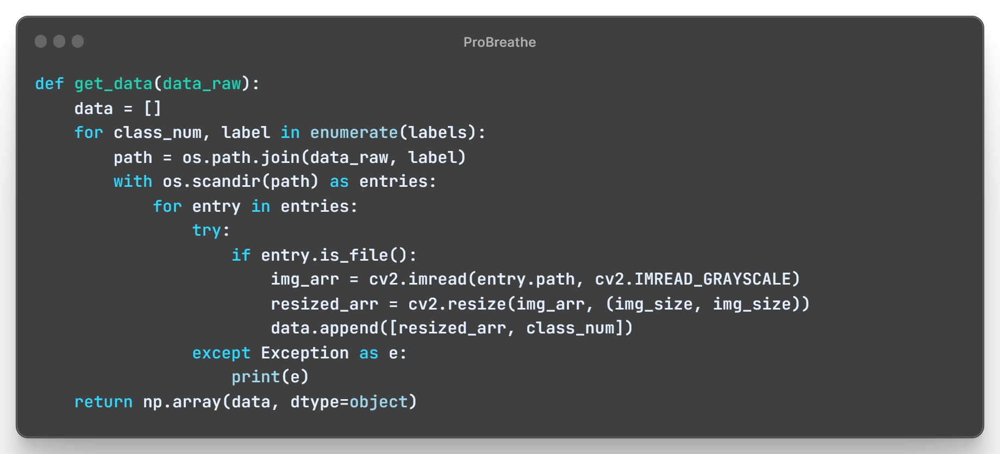

Nun folgt endlich die tatsächliche Einbindung der Daten, sodass sie von dem Modell später zur Analyse und Training verwendet werden können. Dafür wird die im vorherigen definierte Funktion `get_data` aufgerufen. Diese verfolgt die angegebenen Pfade zu den Ordnern entsprechender Bilder, um sie als Variablen in Trainings-, Test- und Validierungsdaten zu unterteilen. Diese Variablen ermöglichen es dann die Datensätze später unumständlich einzubinden und ermöglicht es, sich unter der Bezeichnung der Variabeln auf bestimmte Datengruppen zu beziehen. Die Variablen sind hier `train`, `test`und `val`. So ist `/kaggle/input/chest-xray-pneumonia/chest_xray/train` beispielsweise der Pfad zu den Trainingsbildern. Diese werden alle nach der Ausführung der `get_data` Funktion, und somit auch der Speicherung in einem Numpy-Array, unter der Variable train gespeichert. 

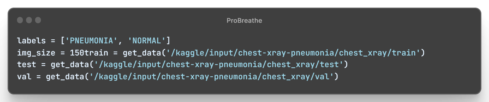

#### Aufteilung in Train-, Test- & Val-Daten
Das Aufteilen der Daten in Trainings-,Test- und Validierungsdaten ist essentiell, um Overfitting zu verhindern. Das Aufteilen der Daten gibt einen Einblick, ob das Modell gelernte Merkmal im Testdatensatz auch auf neue Bilder anwenden kann. Verwendet man nur einen Datensatz für das Training und Evaluieren des Modells, ist unklar, ob das Modell das gelernte Wissen tatsächlich anwenden kann oder zu spezifisch auf die Trainingsdaten angepasst ist und die Merkmale dieser Bilder überinterpretiert. Dies verringert die Nutzbarkeit hinsichtlich der eigetnlichen Funktion des Modells, nämlich bei unebkannten Bildern Vorhersagen zu treffen. Konkret stellen die `train`-Daten, die Bilder bereit, an denen das Modell die verschiedenen Merkmale der Klassifizierungen lernt. In diesem Fall soll zwischen Lungenentzündung und gesundem Patienten unterschieden werden. Die `val`-Daten werden auch während des Traingsvorgang angewendet und dienen dazu, während des Fortschrittes eine unbeeinflusste Einschätzung der schlussendlichen Genauigkeit des Modells zu erhalten. Nämlich muss sich das Modell hier an unbekannten Bilder probieren. Um abschließend nach dem Training die Leistung anhand neuer Bilder zu beurteilen wird auch der `test`-Datensatz benötigt. In dem vorliegenden Datensatz sind die Bilder bereits durch Ordner in diese drei Kategorien unterteilt, sodass sie nur aus den Ordnern wie beschrieben ausgelesen werden müssen.

Um aus Merkmalen Schlüsse ziehen zu können, um welches Label es sich handelt, ist das Aufteilen der Numpy-Arrays in Feature-Arrays(x) und Label-Arrays(y) unabdingbar. Dies erfolgt für Trainigs-,Test- und Validierungsdaten. Hierbei werden die Merkmale als x bezeichnet und y beinhaltet die Zielvariablen, also die richtige Klassifikation als 'PNEUMONIC' oder 'NORMAL'. So lernt das Modell anhand der Bilder der x-Arrays die Merkmale und die daraus gezogene Klassifikation wird mit dem richtigen Label der y-Arrays verglichen. Bei der Erstellung der Feature-Arrays wird also `image for image` verwendet, da für jedes Element (image) das Bild selbst zum Training extrahiert werden muss. Bei den Label-Arrays(y) wird anstatt des Bildes das Label beziehungsweise Klasse des Bildes extrahiert. Somit ergibt sich `label for image`. Das Label wird dann unter der Variable train/test/val gespeichert, also zum Beispiel `label in train`. Somit werden die Bilder und Labels getrennt, durch x und y_train, aber ermöglichen dennoch die Zuordnung zueinander.

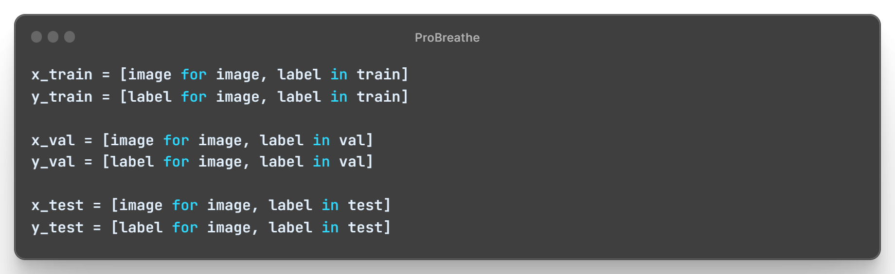

Nun lohnt es sich die Fälle im Trainingssatz zu visualisieren. Vorerst muss die Unterteilung in positives für eine Lungenentzündung und negatives für normale Fälle vorgenommen werden. Dafür werden die Listen `positives` und `negatives` erstellt. Der Term `y_train` gibt nun das Label des i-ten Trainingsbeispiels an, was ja mit 0 oder 1 gleichzusetzen ist. Mit `if y_train[i]` wird überprüft, ob das Label tatsächlich positiv ist, also ob die Bedingung =1 zutrifft. Wenn dies der Fall ist wird es der entsprechenden Liste zugeführt. Für die `negatives` Liste wird dementsprechend if not `y_train[i]` überprüft. Natürlich wird die Länge des Arrays auf y_train gesetzt, da schließlich die Labels zur Evaluierung als negativ oder positiv dienen. Das i gibt dabei den Index, also Platz in der Liste an, sodass for `i in range(len(y_train)` gilt.

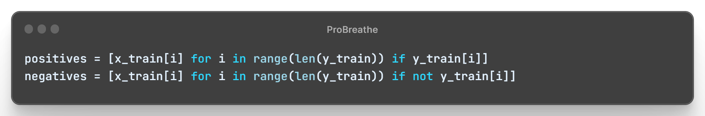

Um die Anzahl der Fälle im Trainingssatz zu veranschaulichen, wird ein Balkendiagramm erstellt. Dieses wird mit den Labels beschriftet und die Höhe der Balken entspricht der Länge der Listen (positiv und negativ). Die Farben Grau und Grün werden gewählt, der Titel wird festgelgt durch `plt.title` und die y-Achse wird als Anzahl beschriftet.

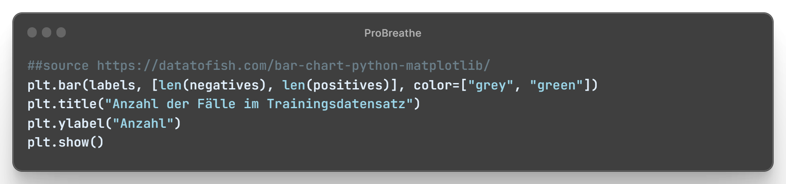

Zudem sollen die Beispiele der Fälle gezeigt werden. Dazu kann ein Element an i-ter Stelle gewählt werden, hier wird das erste Bild der positiven Liste entnommen und das 5. der negativen `negatives[4]`. Des weiteren werden die Titel gewählt und das normale Beispiel in Graustufen ausgegeben, da so für das menschliche Auge besser zwischen den Merkmalen der Beispiele unterschieden werden kann.

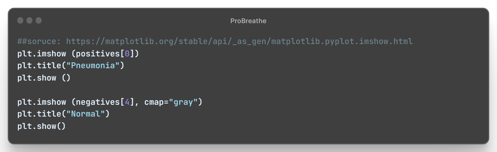

 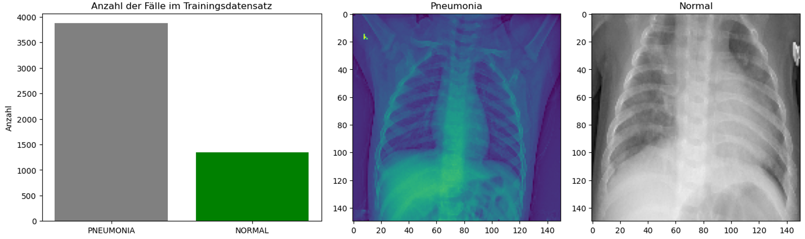 

#### Normalisierung der Daten
Die Division durch 255 ermöglicht die Normalisierung der Bilddaten auf einen Wertebereich zwischen 0 und 1. Nämlich werden Pixelwerte im Regelfall als Ganzzahlen zwischen 0 und 255 dargestellt, wobei 0 für Schwarz steht. 255 stellt widerrum Weiß dar. Die Normalisierung der Bilddaten ermöglicht es, den Wertebereich der Daten zu begrenzen. Dies kann dazu beitragen, die Stabilität und Konvergenz des Modells während des Trainings zu verbessern. Gleichzeitig wird die Liste `x_train` in ein Numpy-Array umgewandelt, was die spätere Handhabung der großen Datenmenge erleichtert.

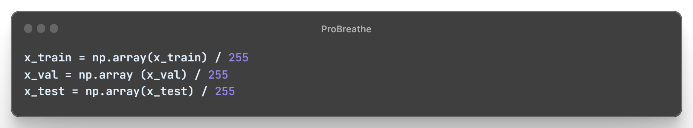

Darüber hinaus werden zur Vorbereitung für das Modell die Bildelemente skaliert und der Farbkanal gewählt. Dafür wird die `reshape` Funktion implementiert. Die -1 sorgt dafür, dass die Anzahl der Datensätze gleichbleibt, während die anderen Dimensionen angepasst werden. Konkret wird die Bildgröße `img_size` nun auf 150 x 150 Pixel angepasst und der Kanal 1 gewählt, also Graustufen. Wie bereits angesprochen ermöglicht dies den Fokus auf die Helligkeitsstufen des Bildes zu legen, sodass Merkmale späzer einfacher erkannt werden können. Die Anpassungen erfolgen für die Numpy-Arrays x und y, sowie für den gesamten Datensatz, also alle Variablen. Mit `x_val[0].shape` erfolgt anschließend die Überprüfung der Anpassung. Es wird Auskunft über die Anpassung des ersten Bildes der Validierungsdaten gegeben in Form der Größe und Anzahl der Dimensionen.

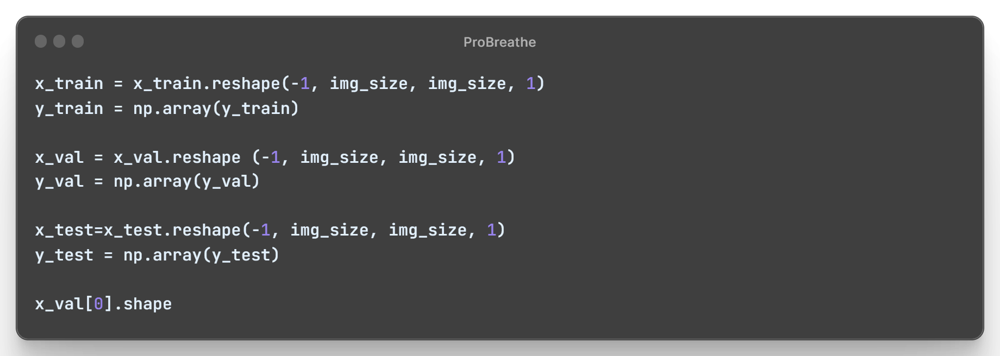

#### Data Augmentation
Die Data Augmentation dient beim Machine Learning dazu, die vorhandene Datenmenge durch verschiedene Änderungsverfahren zu vergößern. Mit dem `ImageDataGenerator`wird das Verfahren  automatisch auf die Bilddaten angewandt. Konkret werden folgende Verfahren mit den Daten ausgeführt; Per Zufall werden die Bilder um 0.2 rangezoomt. Ebenso erfolgt die zufällige horizontale bzw. vertikale Verschiebungen der Bilder. Beide Faktoren wurden auf 0.1 gesetzt, sodass die Bilder um bis zu 10% in ihrer Breite bzw. Höhe verschoben werden. Abschließend werden die Bilder vertikal gespiegelt. Insgesamt wird die Diversität des Datensatzes erhöht und somit das Überinterpretieren bestimmter Merkmale verhindert.
Zum Schluss wird `datagen.fit(x_train)` aufgerufen, um den ImageDataGenerator auf die Trainingsdaten x_train anzupassen. 

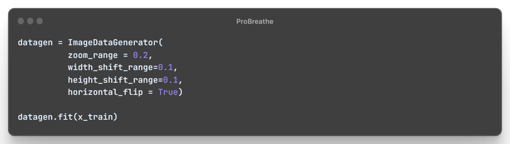

### Modellarchitektur 
Nach der Datenvorbereitung wird das Herzstück des Projektes selbst erschaffen. Das CNN wird aus verschiedenen Schichten aufgebaut, welche über Gewichte miteinander verbunden sind. Jedes Bild wird mit sogennaten Neuronen je Pixel evaluiert. Die Neoronen erhalten dabei den Helligkeitswert zwischen 0 und 1, so könnnen Merkmale erkannt werden. Eine Matrix, ein sogennanter Filter, einer bestimmten Pixelgröße schiebt sich dabei schrittweise über das Bild um dies zu bestimmen. Diese Information wird über Gewichte, also Paramter an die Neuronen der nächsten Schicht weitergegben, sodass bestimmte Informationen wichtiger für ein Merkmal sind. Diese Gewichtungen bestimmenb letztendlich die Zuordung eines Elements zu einer Klasse. Schlussendlich können so Merkmale erkannt und evaluiert werden.
Mit `model = Sequential()` wird ein sequentielles Modell initialisiert, welches dann Schicht für Schicht aufgebaut wird. Insgesamt besteht das Modell aus 5 Convolutional Schichten, welche durch `model.add(Conv2D)` hinzugefügt werden. Dabei wird dann die Filteranzahl definiert, welche sich als kleine Matrix über das Bild schiebt. Zudem wird die Schrittweite `strides` festgelegt, mit der sich der Filter über das Bild schiebt. Auch wird `padding='same'` verwendet, sodass die Ausgabegröße der Schicht mit der Eingabegröße übereinstimmt. Im Detail wird hier der Rand des Bildes mit 0 aufgefüllt, sodass Informationen am Rand des Bildes nicht verloren gehen. Ebenso wird zur Optimierung die Aktivierungsfunktion `relu` verwendet, welche nur positive Werte weiterleitet und negative Werte auf 0 setzt. Dies hat zur Folge, dass bestimmte Neuronen deaktiviert werden, um Overfitting zu verhindern. So wird das Modell weniger anfällig für das Auswendiglernen der Trainingsdaten. In der ersten Convolutional Schicht wird auch die Eingabeform für die Bilder auf 150 x 150 Pixel und den Kanal 1 festegelegt, was den Anpassungen der vorbereiteten Daten entspricht. Zwischen den Conv2D Schichten werden diese Parameter beibehalten und lediglich die Filteranzahl vergrößert, um 
komplexere Merkmale zu erfassen. Die zweite Convolutional Schicht weist zum Beispiel 64 Filter der Größe 3x3 Pixel auf, welche mit der Schrittweite 1 über das Bild verschoben werden. Jedoch wird in den letzten beiden Schichten der Filter auf 2x2 verkleinert, um komplexere Merkmale zu erkennen. Nach jeder `Conv2D Schicht` wird außerdem eine `BatchNormalization`- Schicht mit `model.add` hinzugefügt. Diese Schichten ermöglichen es den Output der vorherigen Convolutional Schicht zu normalisieren, indem in Minibatches Durchschnitte berechnet werden. Weitere Schichten sind die Drop-out Schichten, welche eine Form der Regularisierung sind und Overfitting verhindern. Dabei werden zufällig bestimmte Neuronen nicht in die Berechnung einbezogen mit einer gewissen `rate`. Vergleichsweise in der zweiten Dropoutschicht lautet dieser Faktor 0.1, wobei 10% der Neuronen ausgeschaltet werden. Der Faktor wird in den letzten zwei Conv2D Schichten auf 0.2 erhöht, da die große Filternazahl dies nötig macht. Nach jeder Convolutional Schicht folgt darüber hinaus eine `MaxPool2D` Schicht, um konsequent Overfitting zu vermeiden. Diese Schicht unterteilt das Bild in Rechtecke zur Bestimmung von den maximalen Helligkeiswerten, was  die Dimensionalität der Merkmale reduziert. Dabei wird das Rechteck auf eine bestimmte Größe festgelegt. Beispielsweise in der 2. Conv2D Schicht wird das Rechteck auf 2x2 Pixel festgelegt. Diese Schichtarten werden nun 5 mal eingebunden.
Nachdem mit den Convolutional Schichten wichtige Merkmale der Bilder extrahiert werden konnten, sind die `Dense` Schichten für den Lernanteil verantwortlich, wobei die Merkmale verwendet werden, um Muster zu erkennen, die mit Lungenentzündungen zusammenhängen. Das bedeutet, dass der Output der Conv2D-Schichten angewandt wird, um die Bilder zu klassifizieren. Da zur Klassifizierung eindimensionale Daten benötigt werden, nimmt die `Flatten` Schicht zuvor die Änderung der Datenstruktur zur eindimensionalen Form vor. Diese Schichten verbinden jedes Neuron aus der vorhergehenden Schicht mit jedem Neuron in der nächsten Schicht. Sie dienen dazu, die erlernten Merkmale zu integrieren und die endgültige Klassifizierung oder Vorhersage des Netzwerks zu erzeugen. Die Anzahl der Ausgangsneuronen wird durch den Parameter units festgelegt. In diesem Fall hat die Schicht 128 Neuronen. Der Aktivierungsfunktion 'relu' (Rectified Linear Unit) wird verwendet, um nicht-lineare Transformationen auf die Daten anzuwenden, was dem Modell hilft, komplexe Muster zu lernen. Um Overfitting zu vermeiden, dient eine weitere Drop-Out Schicht. Die darauffolgende Dense-Schicht verwendet genau ein Neuron und die `sigmoid` Funktion wird als Aktivierungsfunktion verwendet. Diese wandelt die Realzahlen des Inputs im Output in einen Wert im Intervall zwischen 0 und 1 um. Der Output dieses letzen Neurons repräsentiert, wie wahrscheinlich es ist, dass das Bild zur Klasse 1 gehört, also eine Lungenentzündung aufweist.

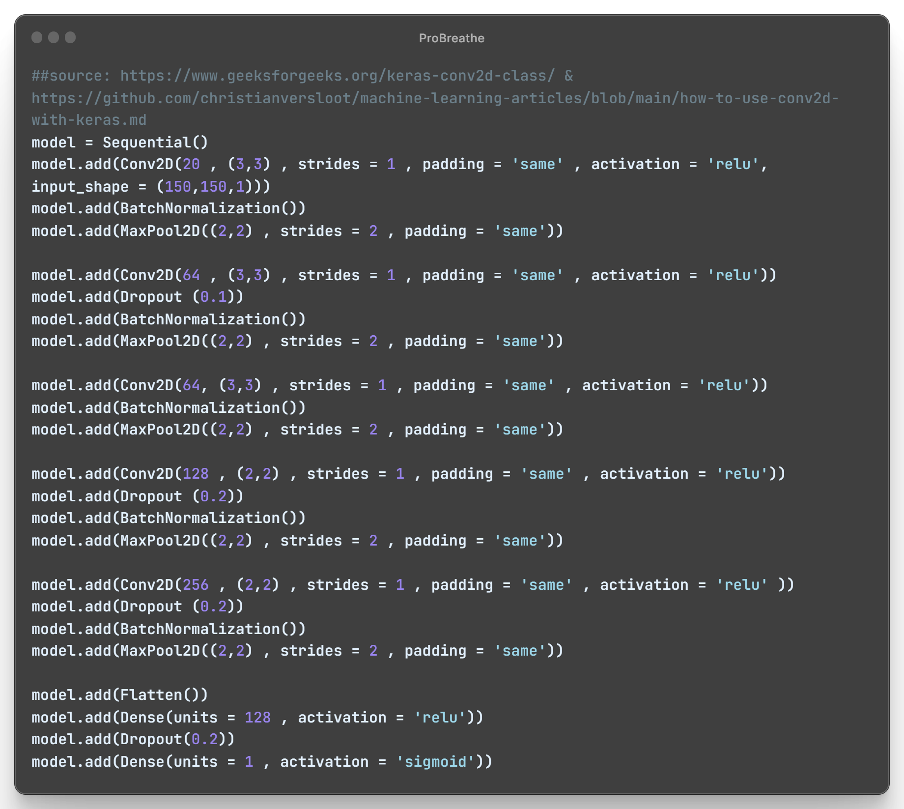

#### Verhalten des Modells im Training
Mit der Anweisung `model.compile` wird das erschaffene Modell für das Training konfiguriert. Dabei bestimmt der Optimierer, wie das Modell seine Gewichte während des Trainings anpasst. Hier wird 'RMSprop' als Optimierungsalgorithmus gewählt, der die Lernrate für jedes Gewicht anpasst, also wie schnell das Training voranschreitet. Auch wird die Verlustfunktion `binary_crossentropy` im Modell implementiert. Sie misst den Unterschied zwischen der vorhergesagten Wahrscheinlichkeit und der tatsächlichen. Anschließend wird versucht den Verlust möglichst gering zu halten. Zuletzt werden die Metriken zur Überwachung als Genauigkeit bestimmt, da diese die Funktion des Modells adäquat darstellt. Die Methode `model.summary` gibt eine Zusammenfassung des gesamten Modells aus und unter anderem wird die Gesamtanzahl der Paramter dargestellt. Dies ist wichtig um eine Übersicht über das Modell zu erhalten. Zur Verbesserung des Trainingsprozesses werden des Weiteren die Learning Rate Reduction und Early Stopping eingebunden. Dafür werden die Callback-Klassen aus Keras importiert. EarlyStopping ist eine Technik, um zu verhindern, dass das Modell "overfittet" wird, indem das Training frühzeitig gestoppt wird, wenn der ausgewählte Leistungsindikator des Validierungsverlust val_loss für eine bestimmte Anzahl von aufeinander folgenden Epochen (in diesem Fall 3 Epochen, angegeben durch patience=3) nicht verbessert wird. Entscheidend ist auch die `learning_rate_reduction`, welche die Lernrate automatisch reduziert. Diese wird reduziert, wenn die Validierungsgenauigkeit, überwacht mit `monitor='val_accuracy' für eine bestimmte Anzahl von aufeinander folgenden Epochen (in diesem Fall 2 Epochen, angegeben durch patience=2) nicht verbessert wird. Die neue Lernrate ist ein bestimmter Prozentsatz (30%, angegeben durch factor=0.3) der vorherigen Lernrate. Die verbose=1-Option sorgt dafür, dass Statusmeldungen ausgegeben werden, wenn die Lernrate geändert wird. Schließlich stellt min_lr=0.000001 sicher, dass die Lernrate nicht unter einen bestimmten Wert fällt.
Durch diese Optionen soll die Leistung des Modells gesteigert werden.

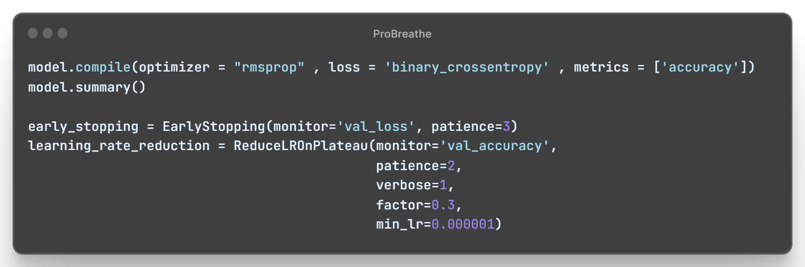

### Training des Modells
Nachdem die Modellarchitektur festegelegt ist, kann das fertige Modell nun trainiert werden. Alle Vorbereitungen werden nun praktisch vom Modell umgesetzt.
Die Funktion `model.fit` steuert das Training des Modells. Das erste Argument `datagen.flow(x_train,y_train,...)` bezieht sich auf den Trainingsdatensatz. Die Funktion `datagen.flow` führt hierbei die Echtzeit-Data-Augmentation durch. Sie nimmt die Trainingsdaten (x_train und y_train) und erzeugt kontinuierlich Batches von augumentierten Daten. Die batch_size gibt in diesem Zusammenhang an wie groß die Teilmenge der Daten ist, die auf einmal verarbeitet wird. Die Epochenanzahl bestimmt hingegen, wie oft der Trainingssatz durchlaufen wird. Im zweiten Argument werden nun die Validierungsdaten evaluiert `validation_data = datagen.flow(x_val, y_val)`. Es werden die Epochenanzahl epochs = 20 und die Batch-Größe batch_size = 20 gewählt. Schlussendlich werden die callback-Funktionen implementiert.

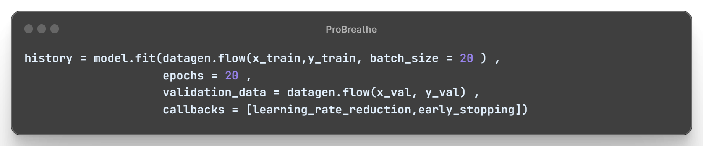

### Leistung & Genauigkeit
Die überwachten Metriken `accuracy` und `loss` sollen nach dem Training ausgegeben werden, um das Modell hinsichtlich seiner Leistung auszuwerten. Um dies auszuführen, dient die `model.evaluate` Funktion, welche den gesamten Testdatensatz, also x_test und y_test beurteilt. So wird das Modell an neuen und unbekannten Bildern eingewertet. Die Methode gibt eine Liste zurück, wobei das erste Element (Index 0) der Verlust (Loss) und das zweite Element (Index 1) die Genauigkeit (Accuracy) ist. Für den Verlust wird also auf das erste Element [0] zurückgegriffen und für die Genauigkeit auf das zweite [1]. Beide Metriken werden mit "print" ausgegeben, wobei die Genauigkeit in Prozent angezeigt wird.

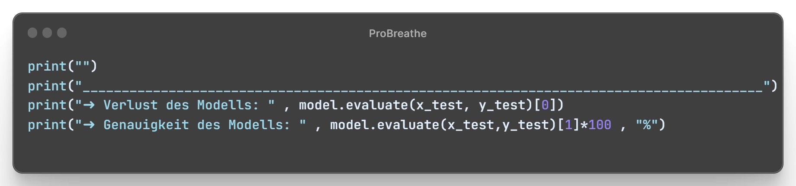

Wenn die besten Ergebnisse erzielt wurden, kann das fertige Modell mit `model.save` gespeichert werden und die Datei erhält den Namen "ProBreathe-model.h5".
Die höchste Genauigkeit stellte bei uns schlussendlich 92% dar.

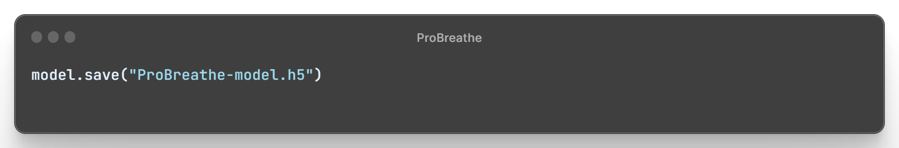

### Anwendung 
#### Klassifizierung neuer Bilder
Das trainierte Modell soll nun seinen eigentlichen Zweck erfüllen und eingespeiste Rötgenaufnahmen des Thorax auf eine Lungenentzündung untersuchen. Schließlich soll die Lunge also betroffen oder gesund klassifiziert werden.
Die Funktion `load_model` von keras wird importiert, um das Laden des gespeicherten Modells zu ermöglichen. Das gesicherte Modell unter dem Dateinamen `ProBreathe-model.h5` wird nun geladen und der Variable `model_new` zugewiesen. Somit ist das Modell für folgende Vorhersagen in der Lage, ohne sich erneut dem Trainingsprozess unterziehen zu müssen. Um nun die Vorhersage und Klassifikation der neuen Bilder zu ermöglichen, wird die Funktion `xrayClassification` definiert, die eine erneute Skalierung der Bilder beinhaltet und die Anweisungen zur Vorhersage für neue Bilder erteilt. Dabei erhält die Funktion ein Bild `(img)`. Da nun der Benutzer neue Bilder einfließen lässt, müssen diese auch für das Model vorbereitet werden, um eine konstante Rechenleistung zu ermöglichen. Somit wird das Eingabebild in ein Numpy-Array konvertiert und normalisiert die Werte durch Division durch 255. Ebenso wird erneut die  `img.reshape` Funktion, wie für den Datensatz zum Training des Modells, angewandt. Die Vorhersage erfolgt nun anhand der folgenden Zeilen. `is_pneumonic = model.predict(img)[0]:` gibt den Befehl, ein Bild mithilfe des Modells zu klassifizieren. Dabei gibt model.predict(img) ein Array von Wahrscheinlichkeiten für jede Klasse zurück. [0] wird verwendet, um das erste Bild des Arrays zu extrahierenden und mit `model.predict` wird der Vorhersagewert für dieses Wert gebildet. Im nächsten Schritt wird die Klassifikation definiert, wie sie erfolgen muss. Hierbei wird die Klasse, hier `img_class` als Normal bezeichnet, wenn der ermittelte Wert unter dem festgelegten Schwellenwert 0.5 liegt. Dies bietet sich an, da der Wert genau in der Mitte zwischen 0 und 1 liegt. Andernfalls über 0.5 wird das Bild als Pneumonic klassifiziert.

#### Gradio-Schnittstelle
Gradio wird importiert, um die interaktive Benutzoberfläche zu erstellen und zu verwenden. Gleichermaßen müssen auch die Komponenten Image und Label für gradio importiert werden. 
Dann wird das Interface mit einer Bildgröße von 150 x 150 Pixeln erstellt, was an die Größe der vorhandenen Bilder angepasst ist. Es wird eine Labelkomponente hinzugefügt, welche das Ergebnis der Klassifikation anzeigt. Konkret bewirkt `label = Label(num_top_classes=1)`, dass nur das wahrscheinlichste Ergbenis angezeigt wird. Das interface wird anschließend mit Titel und "default" Modus eingestellt, wobei gradio automatisch die beste Formatausgabe wählt. Als input wird das Bild gewählt, was evaluiert wird und dann einen output als Label "Pneumonic" oder "Normal" erhält. Zuletzt erstellt gradio das Interface mit `interface.launch` im debug-Modus. Nun kann der Benutzer jegliches Röntgenbild des Thorax einfügen und das trainierte Modell evaluiert es als normal oder von einer Lungenentzündung betroffen.

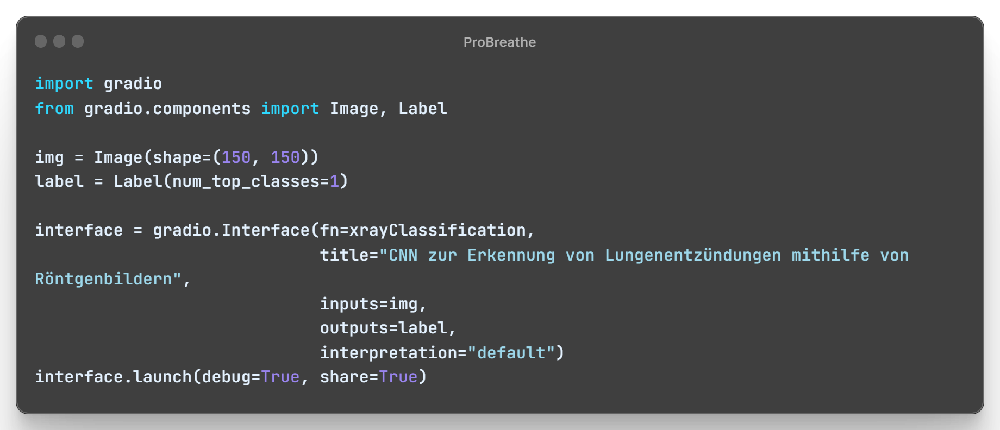

  

## 5. -Projektzusatz- Einfluss verschiedener Parameter
Auch wenn das Modell und seine Genauigkeit das Projekt zur Klassifizierung eines Röntgenbildes der Lunge durchaus funktionsfähig machen, kann der Einfluss verschiedener Parameter genauer untersucht werden, sodass die Anpassung dieser nicht empirisch ermittelt wird. Dies dient nicht nur der systematischen Analyse um des Wissens willen, sondern wir wollten das Optimum aus unserem Modell und dem Datensatz herausholen. 

### Hyperparameteroptimierung durch GridSearchCV
Zuerst müssen dafür über den Pythonpaketmanager scikeras und keras hinzugefügt werden. `Scikeras` ermöglicht die Funktion der Bibliothek `scikit-learn`.  Die Funktion `GridSearchCV`, die die Hyperparameteroptimierung letztendlich durchführt, ist nämlich eine Funktion der `scikit-learn` Bibliothek. 
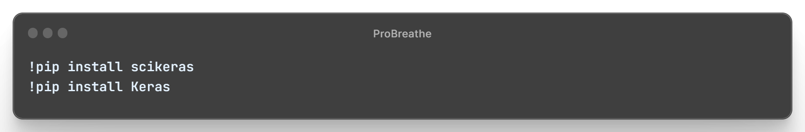
Dann wird für die `Grid Search` Funktion Code bei der Modellarchitektur hinzugefügt, da diese angepasst wird. Dabei nimmt die Funktion `create_model` mehrere optionale Argumente also hier Parameter entgegen, um mehrere Modelle mit verschiedenen Parameterkombinationen zu überprüfen und das beste Modell zu wählen.
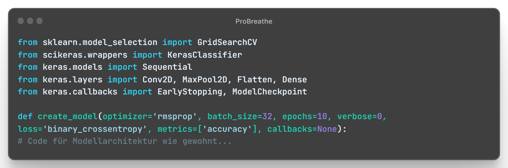
Dann wird der `KerasClassifier` erstellt, welcher die Variable model mit der Funktion `create_model` initialisiert. Dieser ist dafür zuständig, das Keras-Modell in das Scikit-learn-Framework einzupflegen, sodass die Funktion grid search für das Modell durchgeführt werden kann. Diese wird mit dem Suchgitter `param_grid` vervollständigt, welches sie anwendet, um die Hyperparameteroptimierung druchzuführen. Die Variationen der Parameter, die miteinander kombiniert werden sollen, werden hier festgelegt. Dabei legten wir den Fokus auf die Epochen und die Batch-Größe, da diese erfahrungsgemäß den größten Einfluss auf die Genauigkeit haben und der Rechenaufwand der grid search Funktion bereits unzählige Stunden aufgrund der Kombinationsmöglichkeiten dauert. Dabei wird das Modell anhand der Metriken `accuaracy` `precision` und `recall` bewertet. Während des Trainingsprozesses können außerdem die callback Optionen Early Stopping und Learning Rate Reduction eingreifen.
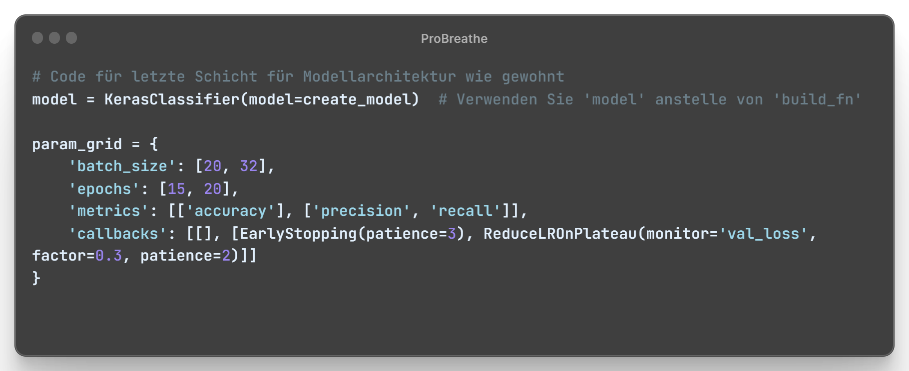
Nun wird das tatsächliche Gitter-Objekt erstellt, dass für die Suche verwendet wird. Es handelt sich um das `GridSearchCV` Objekt, wobei der Parameter `estimator` das zu verwendende Modell enthält. Die Variable `param_grid`enthält unser definiertes Gitter, wo verschiedene Parameter und ihre Optionen definiert wurden. Verbose wird auf 2 gesetzt, um Ausgaben während der Gittersuche zu erhalten. Eigentlich sollte der Fortschritt mit der Bibliothek tqdm und einem Balkendiagramm dargestellt werden, daber dieser Output genügt. `Cv` legt fest, in wie viele Teile die Daten unterteilt werden und wie oft das Modell durchlaufen wird. Schließlich werden die besten Ergebnisse mitsamt ihrer besten Genauigkeit der Suche ausgegeben.

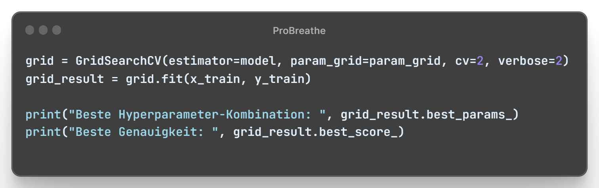

Hier sind einige Beispiele, wie der Output angezeigt wird und wie die Epochen durchlaufen werden.

  
Hier sind einige Beispiele, wie der Output angezeigt wird und wie die Epochen durchlaufen werden.

  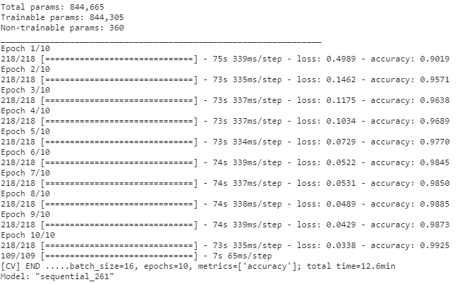
  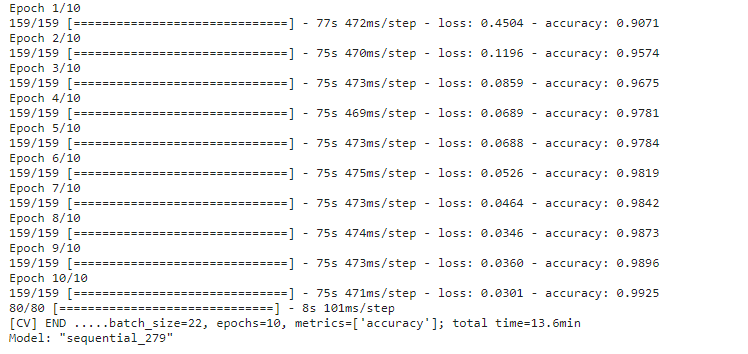
  
  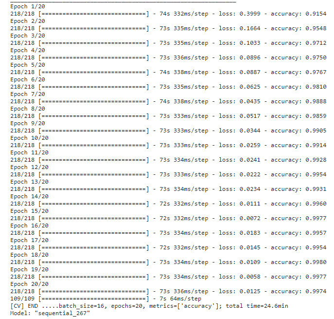
  
  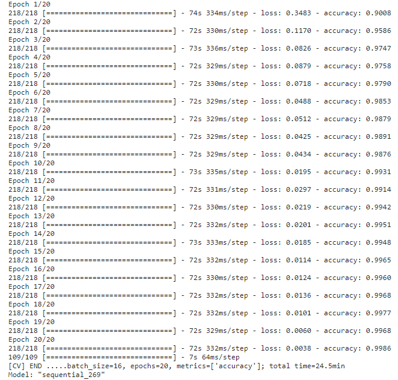
  
  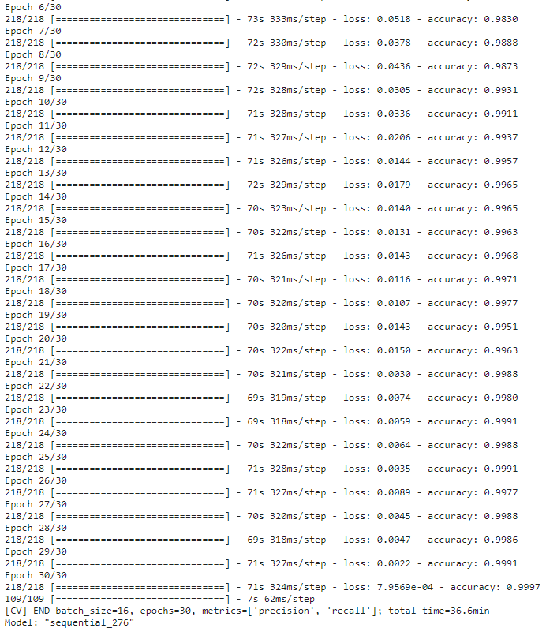
  

  
Dauer des Durchlaufs

  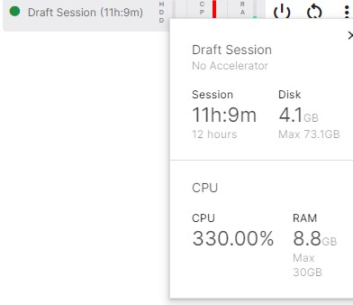

Die besten Parameter stellten für unser Modell `epochs=20 `und `batch_size=32 `dar.

### Empirischer Versuch Änderung Data-Augmentation
Für unser fertiges Modell werden bei der künstlichen Erzeugung neuer Daten während der Datenvorbereitung Änderungen an der `zoom_range, with_shift_range, height_shift_range, horizontal_flip` vorgenommen. Allerdings lässt sich auch das Bild zufällig um 30 Grad drehen, wobei sich die Frage stellt, wie nötig solche spezifischen Verfahren tatsächlich sind. Um dies zu überprüfen, wurden die Bilder versuchsweise um 10° und 30° gedreht. Dafür wurde wegen des Zeitaufwandes, das Modell lediglich mit 2 Epochen und der batch_size=50 trainiert. Es ergab sich bei 10° eine Genauigkeit von 37,5% und bei 30° eine Genauigkeit von 37,6%. Mit einer Differenz gerade so bei 0,1% können wir diesen Einflussfakotr als irrelevant einstufen, auch während vorheriger Versuche zeigt er keinen erkennbaren Einfluss.
Für das zufällige horizontale Spiegeln beobachten. Mit `horizontal_flip = True` ergab sich eine Genauigkeit von nur 54% und für `false` wiederum eine Genauigkeit von 62,5%. Hier ist zu beachten, dass dies auf das Modell mit 2 Epochen zutrifft. Unser komplexes Modell war auch die umfangreiche data augmentation angewiesen.

## 6. Das Ergebnis & Anwendung

Hier nun eine Schritt-für-Schritt-Anleitung, um das Modell selbst auszuführen. 
1. Klicken Sie auf den Button, um die kaggel-Projektseite zu öffnen.

    <a href="https://www.kaggle.com/code/nelecr/probreathe-working?scriptVersionId=135079753&cellId=11">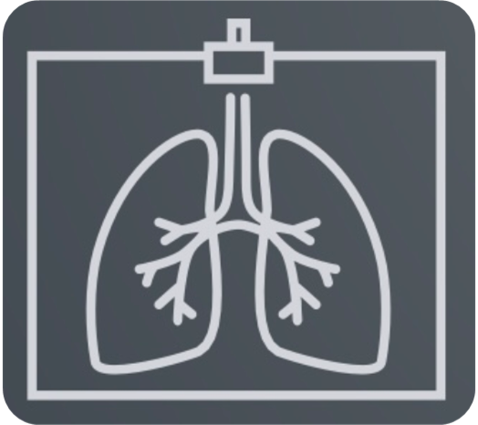</a>

2. Auf der Seite angelangt, sehen Sie nun das Interface und können beginnen Bilder einzufügen.

  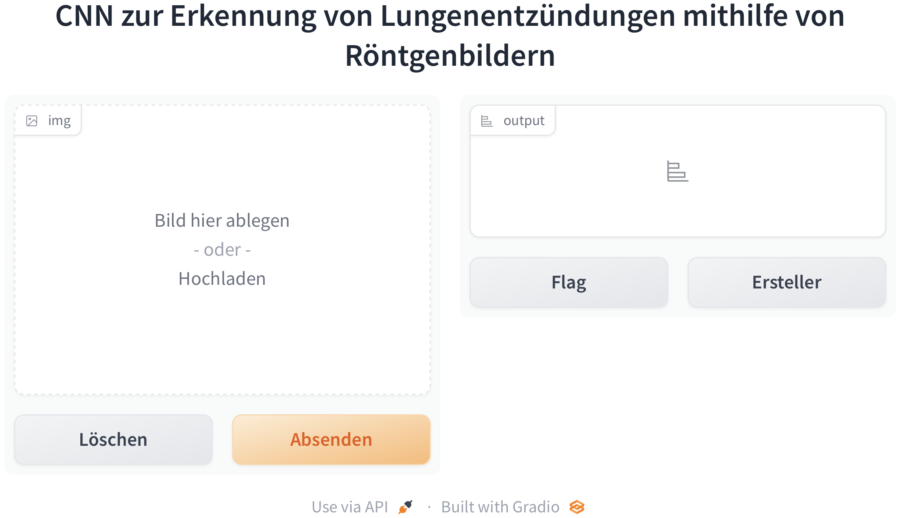

3. Um ein Bild einzufügen, müssen Sie dieses zuerst lokal abspeichern. Über den Download-Button können Sie zwei Beispielbilder herunterladen, welche nicht im Trainingsdatensatz des Modells enthalten waren. Sie können aber auch andere beliebige Röntgenbild von einer Lunge einfügen.

  

4. Probleme mit dem Interface? Führen Sie den Code selbst nochmal aus (Ergebnis kann stark abweichen) oder schauen Sie sich das  <a href="test">YouTube-Video</a> an.
   Um den Code selbst ausführen zu können, müssen Sie sich ein <a href="https://www.kaggle.com/account/login?phase=startRegisterTab&returnUrl=%2F">Konto erstellen</a> und dann unterm dem <a href="https://www.kaggle.com/code/nelecr/probreathe-working?scriptVersionId=135078218&cellId=11">Link zum Code</a> auf `Copy & Edit` clicken. Informationen zum Umgang mit kaggle finden Sie <a href="https://github.com/NTCR7/ProBreathe/blob/main/README.md#2-einf%C3%BChrung--grundeinstellungen-in-kaggle">hier</a>.

## 7. Reflexion
Mit __**ProBreathe**__ sind wir noch einen Schritt weiter gegangen als mit <a href="https://github.com/NTCR7/ProPlant/blob/main/Projektseite.md"> __ProPlant__. </a> Wir haben ein CNN zur Erkennung von Lungenentzündung entwickelt.
Das Thema haben wir am Anfang direkt mit Herrn Buhl abgesprochen. So konnten wir uns mit gutem Gewissen und vollem Elan diesem Thema widmen. Durch die Wahl des Themas, das sowohl unsere Interessen im Bereich der künstlichen Intelligenz als auch im Bereich der Medizin verbindet, hat es uns sehr viel Spaß gemacht, mit Begeisterung an dem Projekt zu arbeiten. 
Am Anfang haben wir uns die Zeit genommen, um uns gründlich in die Themengebiete einarbeiten zu können. Im Laufe des Projekts konnten wir viel Wissen und praktische Anwendungskenntnisse über Python und den Bereich der künstlichen Intelligenz mit Fokus auf CNN sammeln.
Für den Erfolg des Projekts war die gründliche Recherche entscheidend. Die Themen und somit die Programmierung konnten durch die Recherche und das selbstständige Erarbeiten von Wissen vollständig nachvollzogen werden. Besonders wichtig war auch die Entdeckung von <a href="https://www.kaggle.com/">kaggle</a>. Die Unterstützung durch die Website hat uns die Möglichkeit gegeben, uns voll und ganz auf die Programmierung, also auf den eigentlichen Code, zu konzentrieren. So konnte wichtige Zeit gespart werden. Wenn man sich mit maschinellem Lernen beschäftigt, ist Kaggle ein sehr empfehlenswertes Tool. Die Ein- und Ausgabe, die Programmierumgebung und die Datensätze sind sehr benutzerfreundlich.
Allerdings gab es auch dieses Mal wieder einige Faktoren, die uns in unserem zielstrebigen Workflow eingeschränkt haben. Einen großen Anteil daran hatte leider auch kaggle. Vereinzelt gab es Probleme mit der Erreichbarkeit, vor allem aber wurde ein großer Teil des erarbeiteten Projekts nicht gespeichert. Zusammenfassend kann man sagen, dass kaggle eigentlich ein geniales Werkzeug mit viel Potential ist. Man muss aber vorsichtig sein, wie man seinen Fortschritt speichert. Es empfiehlt sich, den Fortschritt am Code auch außerhalb von kaggle als Backup zu speichern. Bedauerlicherweise fielen zeitweise sogar beide Projektteilnehmer krankheitsbedingt aus, wodurch der Projektfortschritt in dieser Zeit abrupt zum Stillstand kam. 

Alles in allem war das Projekt aber ein voller Erfolg. Insbesondere die enge Kommunikation und Aufgabenteilung innerhalb der Gruppe sorgte für Spaß bei der Arbeit und ein so beeindruckendes Endprodukt.

## 8. Quellenverzeichnis

𝗚𝗲𝗻𝗲𝗿𝗲𝗹𝗹𝗲 𝗪𝗲𝗶𝘁𝗲𝗿𝗯𝗶𝗹𝗱𝘂𝗻𝗴 & 𝗖𝗼𝗱𝗶𝗻𝗴

<a href="https://www.youtube.com/watch?v=O5xeyoRL95U"> Deep Learning Basics</a> 

<a href="https://www.bigdata-insider.de/was-ist-python-a-730480/"> Python</a>

<a href="https://www.geeksforgeeks.org/programming-paradigms-in-python/"> Python</a>

<a href="https://www.youtube.com/watch?v=b093aqAZiPU"> Python Basics</a>

<a href="https://youtu.be/rdaG53khzv0"> Machine Learning with Python</a>

<a href="https://blog.roboflow.com/train-test-split/"> Machine Learning with Python</a>

<a href="https://youtu.be/aircAruvnKk"> Neural Networks</a> 

<a href="https://towardsdatascience.com/convolutional-neural-networks-explained-9cc5188c4939"> Convolutional Neural Networks</a>

<a href="https://www.ibm.com/topics/convolutional-neural-networks"> Convolutional Neural Networks</a>

<a href="https://geekflare.com/de/convolutional-neural-networks/"> Convolutional Neural Networks</a>

<a href="https://www.youtube.com/watch?v=YRhxdVk_sIs"> Convolutional Neural Networks</a> 

<a href="https://www.youtube.com/watch?v=2-Ol7ZB0MmU"> Convolutional Neural Networks</a> 

<a href="https://youtu.be/zfiSAzpy9NM"> Convolutional Neural Networks</a> 

<a href="https://towardsdatascience.com/introduction-to-convolutional-neural-network-cnn-de73f69c5b83"> Convolutional Neural Networks with TensorFlow</a>

<a href="https://www.elektroniknet.de/automotive/assistenzsysteme/verkehrszeichen-sicher-erfassen.132361.html"> Convolutional Neural Networks in use</a>

<a href="https://youtu.be/jztwpsIzEGc"> Build a Convolutional Neural Networks</a> 

<a href="https://www.youtube.com/watch?v=qFJeN9V1ZsI"> Keras with TensorFlow</a> 

<a href="https://youtu.be/jhLtn70XpXQ"> Pneumonia Detection</a> 

𝗹𝗶𝗯𝗿𝗮𝗿𝗶𝗲𝘀

-------------------------
<a href="https://keras.io/">Keras</a>

<a href="https://www.tensorflow.org/guide/keras"> Tensorflow & Keras</a>

<a href="https://www.bigdata-insider.de/was-ist-tensorflow-a-684272/"> Tensorflow basics</a>

-------------------------
<a href="https://docs.python.org/3/library/os.html"> Python os-library</a>

<a href="https://www.digitalocean.com/community/tutorials/python-os-module"> +information Python os-library</a>

-------------------------
<a href="https://opencv.org/"> OpenCV</a>

<a href="https://www.ibm.com/de-de/topics/computer-vision"> Computer Vision</a>

<a href="https://subscription.packtpub.com/book/data/9781838644673/21/ch21lvl1sec133/history-of-opencv-from-v1-to-v4">-Logo"> +information OpenCV</a>

<a href="https://viso.ai/computer-vision/opencv/"> +information OpenCV</a>

-------------------------
<a href="https://matplotlib.org/"> Metaplotlib</a>

<a href="https://github.com/matplotlib/matplotlib"> Metaplotlib GitHub</a>

-------------------------
<a href="https://numpy.org/"> NumPy</a> 

<a href="https://github.com/numpy/numpy"> NumPy GitHub</a> 

-------------------------
<a href="https://seaborn.pydata.org/"> Seaborn</a>

-------------------------
<a href="https://scikit-learn.org/"> scikit-learn</a> 

<a href="https://github.com/scikit-learn/scikit-learn"> scikit-learn GitHub</a> 

<a href="https://www.activestate.com/resources/quick-reads/what-is-scikit-learn-in-python/"> +information scikit-learn</a> 

<a href="https://scipy.org/"> SciPy</a> 

-------------------------
<a href="https://github.com/tqdm/tqdm"> tqdm</a>

<a href="https://towardsdatascience.com/progress-bars-for-python-with-tqdm-4dba0d4cb4c"> +information tqdm</a>

-------------------------
<a href="https://gradio.app/"> Gradio</a>

-------------------------

