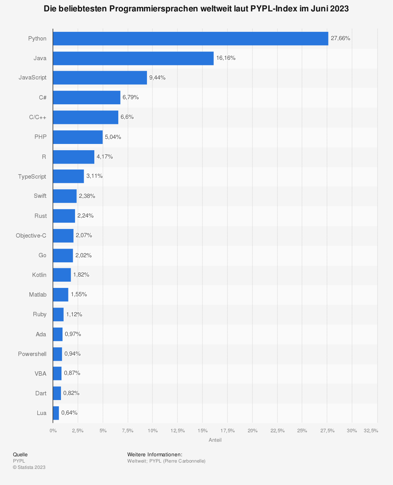
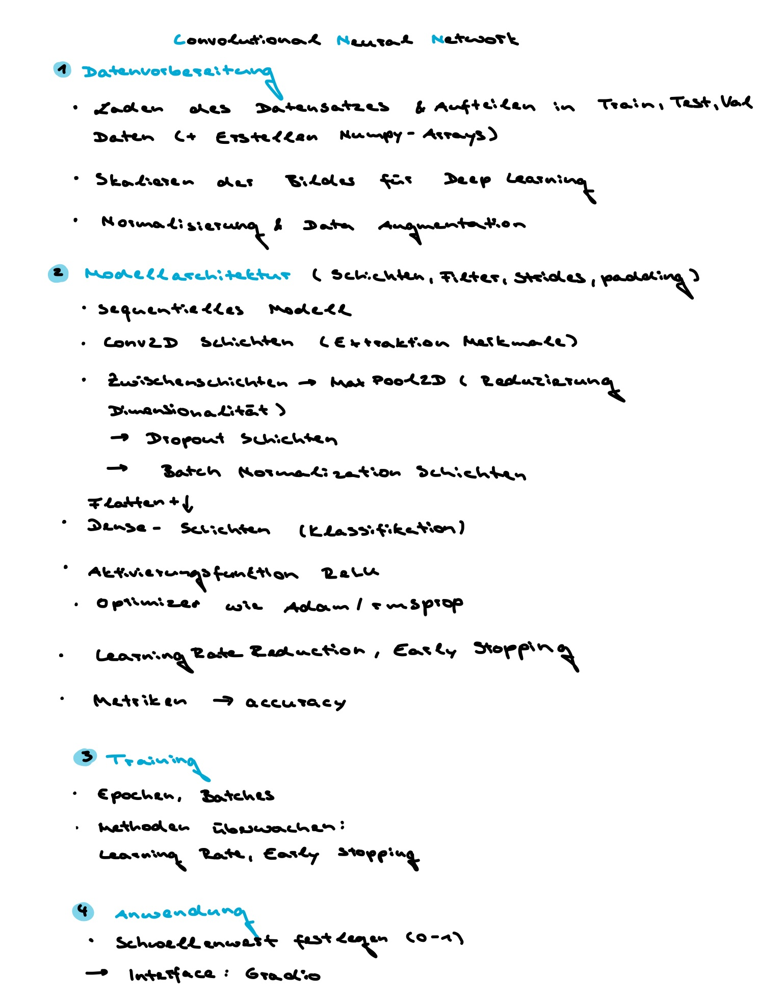
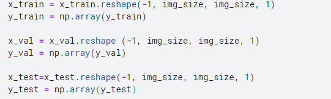
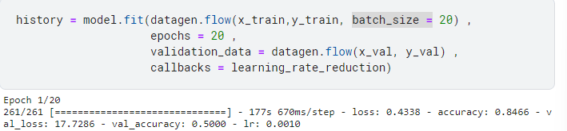

# ProBreathe - Stundenprotokoll
**Ein Projekt von Nele und Tim Ratzka**


## Timeline 📅
|     16.01.23    |     14.02.23    | 20.03.-26.03.23 | 27.03.-02.04.23 | 03.04.-09.04.23 | 24.04.-30.04.23 | 01.05.-07.05.23 | 08.05.-14.05.23 | 15.05.-21.05.23 | 22.05.-28.05.23 | 29.05.-04.06.23 | 05.06.-11.06.23 | 12.06.-18.06.23 | 19.06.-25.06.23 |
| ------------- | ------------- | ------------- | ------------- | ------------- | ------------- | ------------- | ------------- | ------------- | ------------- | ------------- | ------------- | ------------- | ------------- |

## 16.01.23
Diese Stunde wurde von einer Ideensammlung und engagierten Diskussionen geprägt. Obwohl das Stattenfinden des Unterrichts unklar war, begannen wir bereits zuhause neue Projektideen zu entwickeln. Uns war schnell klar; Die Weiterentwicklung unseres ProPLant Projekts mit dem Arduino war nicht genug. Wir wollen uns dieses Semester völlig von der physical computing Welt lösen und den Fokus auf ein tiefgreifenderes Programm legen.  "Was für ein Projekt wollen wir dieses Jahr machen?" stellte sich als ziemlich komplexe Frage heraus, da wir beide unterschiedliche Ansätze wählen wollten. Allerdings waren wir uns über eine Sache sofort im Klaren; Es sollte sich um ein Pythonprojekt handeln. Schon seit Beginn des Informatikunterrichts interessieren wir uns aufgrund unzähliger Anwendungsbereiche und unglaublichen Projekten für die Programmiersprache Python. Zudem stießen wir auf die folgende Statistik, was unsere Annahme bestätigte. Python ist eine so essentielle Programmiersprache, die wir unbedingt beherrschen wollten. Auch wenn wir uns dabei von Grund auf in die Programmiersprache einarbeiten müssen.

<details>
<summary>ausschlaggebende Statistik📊</summary>
  
</details>

Wir haben uns noch nicht endgültig für ein konkretes Projekt entscheiden können, aber wir wollten es auf jeden Fall mit der Medizin in Verbindung bringen. Wir haben beide eine Leidenschaft für dieses Thema und wissen, dass uns ein solches Projekt sehr viel Spaß machen würde.

## 14.02.23
Nun wollten wir unser Projekt in seinem Fundament festlegen, sodass wir uns mit dem tatsächlichen Programmieren und Lernen beschäftigen können.
Weitere Inspiration für ein Python-Projekt versuchten wir heute durch Recherchen zu bekommen, obwohl unser Fokus eigentlich schon feststand: Von der Idee und den Möglichkeiten von AI schon immer fasziniert, wollten wir uns unbedingt in diese Richtung orientieren. Vor dem Unterricht hatten wir schon viele Artikel über künstliche Intelligenz und deep learning gelesen. Wir waren entschlossen, auch ein solches Programm zu entwickeln! Bei unseren Recherchen stießen wir auf Projekte wie die Vorhersage für Aktienkurse, movie recommendations oder auch das Erkennen handschriftlicher Zeichen. Am meisten faszinierte uns allerdings die Image Classification mithilfe eines CNNs. Natürlich fanden wir auch Projekte zum Klassiker der Iris Classification. Allerdings sollte unser Anwendungsbereich auf alle Fälle in der Medizin liegen und wir erkundeten verschiedenen Ansätze wie die Einschätzung des Herzens. Außerdem stellten wir fest, dass sich die Plattform kaggle für ML besonders gut eignen würde, da viele Projkete hier auf die bereits bestehenden Datensätze zugriffen. Dies brachte uns auch auf die Spur der Klassifizierung von Röntgenaufnahmen der Lunge als gesund oder von einer Lungenentzündung betroffen. Der vorhandene Datensatz festigte unsere Überzeugung; wir wollten ein solches Projekt hinsichtlich der Lungenentzündung in Angriff nehmen. Herr Buhl konnte unsere Projektidee bestätigen. Die restliche Zeit wurde damit verbracht, sich mit den Begriffen Neuronales Netz, Deep Learning, Machine Learning und Convolutional Neuronal Network auseinanderzusetzen.

## 20.03.-26.03.23
So wie wir uns ein ehrgeiziges Projekt ausgesucht hatten, ging es jetzt daran die Komponenten Python und das CNN völlig zu durchdringen. Durch umfassende Internetrechereche identifizierten wir die wichtigsten Komponenten unseres Projektes. Dabei spielten neben dem CNN und seiner Architektur auch die Datenvorbereitung und die Anwendung eine große Rolle. Dazu ordneten wir unsere Gedanken folgendermaßen:
<p align="center">
  
<p/>
Außerdem haben wir uns über zahlreiche Python-Tutorials weitergebildet. Zudem erstellten wir unser erstes Notebook auf kaggle. Dabei lernten wir mit den Einstellungen der Plattform umzugehen. Kaggle ist speziell auf das Arbeiten an deep learning Projekten mit riesigen Datensätzen ausgelegt, was sich als großer Vorteil für uns erweist. Allerdings ist das Einarbeiten zwingend erforderlich gewesen, hinsichtlich der Einbindung des Datensatzes, oder wie das Notebook gespeichert werden kann. Wir beginnen also, uns mit der Plattform vertraut zu machen <a href="https://www.kaggle.com/">kaggle</a>. Der bereits vorhandene <a href="https://www.kaggle.com/datasets/paultimothymooney/chest-xray-pneumonia">Datensatz</a> löst ein großes Problem, welches bei der Arbeit mit Python besteht: Der enorme Zeitaufwand einen Datensatz in aufwendiger repetitiver Eigenarbeit zu erstellen. Einen enormen Datensatz von echten Lungen-Röntgenbildern zu finden, erwies sich vorher als unmöglich. Der Datensatz von kaggle ist bereits in drei Ordner aufgeteilt "Test", "Train" und "Val". Diese Ordner besitzen jeweils die Unterkategorien "Pneumonia" und "Normal", auf welche die 5.863 Röntgenbilder von Lungen als JPEGs aufgeteilt sind. Außerdem sind In- und Output bereits komfortabel integriert und die Plattform ermöglicht ein gemeinsames Arbeiten von beiden Projektmitgliedern von unterschiedlichen Geräten aus. Schließlich wurde der Datensatz in den Input eingebunden. Außerdem schauten wir uns ein Beispiel einer Lungenentzündungsvorhersage an. 

## 27.03.-02.04.23
Wir beginnen erstmal mit dem Importieren der wichtigsten Bibliotheken, die für das Projekt benötigt wurden. Dabei kam es erst zu Fehlermeldungen, da einige Pythonpakete vorher über `!pip install` installiert werden müssen, bevor die Bibliotheken importiert werden können. Hier ist auch zu beachten, dass bei kaggle speziell das `! ` benötigt wird, was so bei Python normalerweise nicht der Fall ist. Ebenfalls widmen wir uns dem ersten Aspekt der Datenvorbereitung. Das Definieren der `get_data ` Funktion lief reibungslos ab. Allerdings kommt es beim Aufrufen der Funktion für die Test-, Trainings- und Validierungsdaten zu einer Fehlermeldung. Nämlich kann kaggle die angegebenen Pfade zu den Ordnern nicht finden. Der erste Lösungsansatz bestand darin, die Leseberechtigung mit folgendem Code zu überprüfen:
```c 

import os

directory_path = '../kaggle/input/chest-xray-pneumonia/chest_xray/test'

if os.access(directory_path, os.R_OK):
    print("Der Code hat Leseberechtigungen für das Verzeichnis.")
else:
    print("Der Code hat keine Leseberechtigungen für das Verzeichnis.")
```
Allerdings lag hier gar nicht das Problem. Nach Recherche bei kaggle lag es an den Notebook Options. Hier musste das Internet wie folgt aktiviert werden:


So lernten wir allerdings auch vertieft weiter den Aufbau und Umgang mit der Plattform. Außerdem nahmen wir erfolgreich die Aufteilung in Feature und Label-Arrays vor. Um einen Überblick über den Datensatz zu erhalten, visualisierten wir außerdem die Anzahl der Fälle als Balkendiagramm und zwei Beispiele:
<p align="center">
  
<p/>
Bei der Anpassung der Daten kam es zu einem Hindernis. Wir waren verwirrt, dass nur das `x_train/test/val` mit `reshape` verändert wird. Hier mussten wir uns nochmal einen Überblick verschaffen; So besteht die Modellarchitektur in der letzten Schicht aus einem einzigen Neuron mit der Sigmoid-Aktivierungsfunktion. Diese erwartet, dass die Label-Arrays eindimensional sind. Somit ist folgender Code überflüssig:

  

## 03.04.-09.04.23
Beide Gruppenmitglieder waren in der Zeit vom 03.04. - 05.04. krankheitsbedingt verhindert. Eine Weiterarbeit am Projekt war in dieser Zeit nicht möglich. Außerdem wurde dadurch die Teilnahme am Fachtag verhindert. Auch die restlichen Tage waren aufgrund der schulischen Beanspruchung, des Nachholbedarfs und der Genesung weniger produktiv. 

## 24.04.-30.04.23
Wir schlossen nun die Datenvorbereitung in den letzten Zügen ab und widmeten uns nun der Fertigstellung unserer Modellarchitektur. Die letzte Schicht hatten wir direkt festgelegt, nachdem wir in diesem Zug dafür die Anpassung der y-Arrays nicht benötigt hatten. Wir setzten uns nun konkreter mit der Schreibweise in Python für die Schichten des Modells auseinander, da wir die einzelnen Komponenten bereits kennengelernt hatten, aber nicht wussten nach welchem Schema diese im Code eingebunden werden. Die Erstellung der Modellarchitektur erfolgte ansonsten sehr zielstrebig, da der Aufbau der Schichten für jede weitere Schicht gleichbleibt. Wir setzten die Anzahl der `Conv2D` Schichten vorerst auf 5, da ähnliche Projekte auch diesen Ansatz wählten. Zudem informierten wir uns noch über Optimierungsfunktionen und andere Regularisierung und legten uns da auch fest. Zum Beispiel haben wir den callback `learning rate reducation` in seinen Parametern wie dem Faktor, um die die Lernrate reduziert wird, festgelegt.

## 01.05.-07.05.23
Nachdem nun die Modellarchitektur feststand, widmeten wir uns dem Training des Modells und experimentierten mit der Epochenanzahl und Batchgröße. Um dies zu beurteilen, schrieben wir den Code, um die Leistung des Modells zu beurteilen, also die `accuracy `. Dafür griffen wir auf die `model.evaluate ` Funktion zurück. Gängig erschienen 10 Epochen und wir tasteten uns an höhere Genauigkeiten heran. Dabei ist auch zu beachten, dass eine kleinere Zahl bei `batch_size =` zu einer längeren Rechoperation führt. So ist die Batch-Größe 20 dafür verantwortlich, dass 261 Batches durchlaufen werden.

 

## 08.05.-14.05.23
In dieser Woche setzen wir uns nun mit der Anwendung unseres Projektes auf unbekannte Bilder auseinander. Dafür sahen wir uns bei `gradio` die verschiedenen Interfaces an und versuchten den Code für jenes, bei welchem man ein Bild einpflegt und ein Label erhält, umzusetzen. Den Grundstein hatten wir gelegt, nun musste allerdings die Klassifizierung des Modells noch festgelegt werden. Dafür muss der Schwellenwert zwischen 0 und 1 liegen, da die letzte Schicht diese binäre Klassifikation ausgibt. Auf der Hand lag der Wert 0.5, da er die Mitte darstellt. Allerdings überlegten wir den Wert weiter runterzusetzen, damit das CNN vorsichtiger ist und eher die Krankheit diagnostiziert. Die Falschdiagnose als gesund wäre ein schwerwiegender Fehler. Jedoch entschieden wir uns dagegen, da dies die Ergebnisse zu sehr verfälscht.

## 15.05.-21.05.23
Mittlerweile sind wir soweit, dass wir ein Video als "proof of concept" am Fachtag vorstellen konnten. Leider konnte nur Tim an dem Fachtag teilnehmen, da Nele aus gesundheitlichen Gründen nicht teilnehmen konnte. Während des Tages hat Tim daher hauptsächlich an der GitHub Projektseite gearbeitet. Außerdem wurde von Tim versucht, die Genauigkeit des Modells zu verbessern. Dies war jedoch nicht möglich. Durch einen mehrmaligen Raumwechsel musste der Trainingsprozess immer wieder neu gestartet werden. Das lag natürlich auch daran, dass die Anzahl der Epochen in diesem Experiment sehr hoch war und der gesamte Code für einen Durchlauf 1,5 Stunden in Anspruch nahm. Derzeit muss das Programm bei jedem Durchlauf für 1:10h neu trainiert werden, was natürlich sehr zeitaufwendig und benutzerunfreundlich ist. Deshalb soll der Trainingsfortschritt gespeichert und beim nächsten Mal wieder abgerufen werden. Bis jetzt waren wir nicht in der Lage, den Code oder das Modell zu speichern und Tim hat versucht, eine Lösung für dieses Problem zu finden und die Lösung schien in Keras zu liegen. Es wurde über Checkpoints und das Speichern des gesamten Codes gesprochen. Das Ziel war, dass ein Benutzer nur das Interface öffnen muss und dann direkt interagieren kann, um das Modell zu testen. 

## 22.05.-28.05.23
Aufgrund von MUNOL war Nele erneut die geamte Woche nicht anwesend. Tim war aufgrund eines hohen schulischen Aufkommens und der prkatischen Führerscheinprüfung ebenfalls verhindert.

## 29.05.-04.06.23
Wir konnten Herr Buhl den Code und die einzelnen Abteile ausführlich zeigen und erläutern. (Wir einigten uns außerdem darauf, dass wir die Paramter als Einflussfaktoren analysieren.) Nun begann erneut auch der zeitraubendste Teil, nämlich das empirische Schrauben an den Parameter und das anschließende Durchlaufen der Epochen um die Leistung zu evaluieren.

## 05.06.-11.06.23
Wir wagten uns an die Veränderung unserer Modellarchitektur, wobei wir mit unterschiedlichen Schichten experimentierten. Um Over Fitting zu vermeiden, verringerten wir die Schichtenanzahl der `Conv2D ` Schichten auf 3. Letztendlich ergaben sich 5 trotzdem als am effizientesten.

## 12.06.-18.06.23
Die Frage, wie man den Fortschritt des Modells speichern kann, haben wir am Fachtag weiter untersucht. Es wurde auch getestet, ob es möglich ist, das Modell auf der Grundlage des gespeicherten Verlaufs neu zu trainieren, um die Genauigkeit immer wieder zu verbessern. Dies war jedoch nicht so einfach zu bewerkstelligen, und wir mussten die Idee nach einer Menge Arbeit wieder fallen lassen. Schließlich kamen wir unserem Ziel näher. Wir mussten nur noch die Teile des Codes ausführen, die das Training und die Schnittstelle betrafen. Das Durchlaufen des vorherigen Teils war nicht mehr notwendig, da wir einfach das letzte Modell laden und direkt mit dem Training beginnen konnten. Dabei wurden Trainingsfortschritt und Genauigkeit überschrieben.

## 19.06.-25.06.23
Zuletzt erhöhten wir den Umfang unseres Projektes enorm, da wir es uns zur Aufgabe gemacht hatten, den Einfluss der Parameter genau zu untersuchen. Dabei drehten wir einmal an Stellschrauben der data augmentation, wobei beispielsweise die zufällige Drehung des Bildes um 30 Grad die Effizienz verringert, obwohl das Gegenteil der Fall sein soll. Darüber hinaus informierten wir uns über die Grid Search Funktion, die es ermöglicht, die beste Kombination der Hypermparamter zu ermitteln. Das Programmieren dieser Funktion nahm neue Ausmaße an, zumal neue Bibliotheken wie sciKeras benötigt wurden und die Funktion auf verschiedene Parameter beschränkt ist. Dafür schrieben wir auch Code um diese auszugeben.
Zuvor hatte der Code nicht funktioniert, weil er unsere Anforderungen nicht umsetzen konnte. Da die Funktion jede Kombinationsmöglichkeit der ausgewählten Parameter durchläuft, beschränkten wir uns auf verschiedene Epochen und Batches.  Dies führte uns zu unserem besten Ergebnis des Modells und wir legten die schlussendlichen Parameter fest. Der Aufwand war erheblich, da wir verschiedenen Versuche abbrechen mussten. Beispielsweise Durchlaufen die Funktion beim ersten Versuch, die Parameter über 11 Stunden und war trotzdem nicht fertig.
